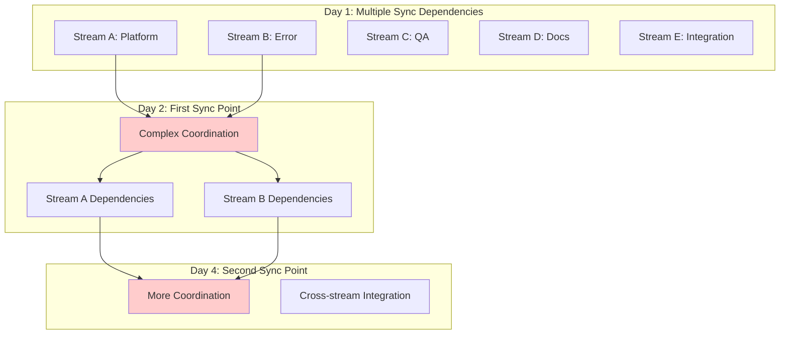
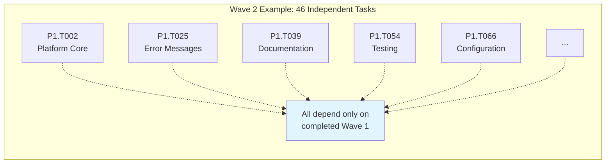
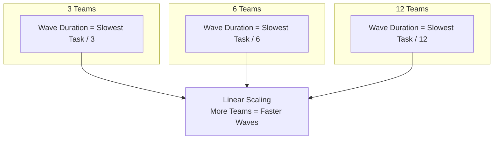

# MECE vs Wave-Based Execution: Comparison Analysis

## 🔄 Execution Model Comparison

### MECE Approach (Previous)


### Wave-Based Approach (New)
```mermaid
graph TB
    subgraph "Wave 1: Foundation (Complete Independence)"
        W1[18 Tasks - Zero Dependencies]
        W1T1[Team 1: Tasks 1-6]
        W1T2[Team 2: Tasks 7-12]
        W1T3[Team 3: Tasks 13-18]
    end
    
    subgraph "Wave 2: Implementation (Complete Independence)"
        W2[46 Tasks - Depend only on Wave 1]
        W2T1[Team 1: Tasks 1-15]
        W2T2[Team 2: Tasks 16-30]
        W2T3[Team 3: Tasks 31-46]
    end
    
    subgraph "Wave 3: Integration (Complete Independence)"
        W3[20 Tasks - Depend only on Wave 1+2]
        W3T1[Team 1: Tasks 1-7]
        W3T2[Team 2: Tasks 8-14]
        W3T3[Team 3: Tasks 15-20]
    end
    
    W1 --> SYNC1[🔄 thread.join()<br/>ALL Wave 1 Complete]
    W2 --> SYNC2[🔄 thread.join()<br/>ALL Wave 2 Complete]
    
    SYNC1 --> W2
    SYNC2 --> W3
    
    style SYNC1 fill:#99ff99
    style SYNC2 fill:#99ff99
```

## 📊 Detailed Comparison

| Aspect | MECE Approach | Wave-Based Approach | Improvement |
|--------|---------------|-------------------|-------------|
| **Sync Points** | Multiple per day | 2 total | 📉 Coordination overhead |
| **Within-Team Dependencies** | Complex cross-stream coordination | Zero coordination needed | 🚀 Complete independence |
| **Team Scaling** | Limited by stream structure | Linear scaling within waves | 📈 Better parallelization |
| **Coordination Effort** | High (daily standups, cross-stream) | Minimal (2 sync points total) | ⚡ Reduced overhead |
| **Risk Management** | Distributed across multiple sync points | Concentrated at logical barriers | 🎯 Cleaner risk isolation |
| **Team Utilization** | ~70-80% (coordination overhead) | >90% (pure execution) | 💪 Higher efficiency |

## 🚀 Wave-Based Advantages

### 1. Complete Independence Within Waves


**MECE Problem:** Stream A task blocked by Stream B completion  
**Wave Solution:** All Wave 2 tasks can execute simultaneously with zero coordination

### 2. Linear Team Scaling


**MECE Problem:** Stream structure limits team additions  
**Wave Solution:** Can add teams indefinitely within each wave

### 3. Simplified Project Management


**MECE Problem:** Complex daily coordination and multiple handoffs  
**Wave Solution:** Simple linear progression with clear milestones

## 🎯 Execution Efficiency Comparison

### MECE Coordination Overhead
- **Daily Standups:** 15 min × 6 days = 1.5 hours
- **Day 2 Sync:** 30 minutes coordination
- **Day 4 Sync:** 30 minutes coordination  
- **Cross-stream Dependencies:** ~2-4 hours of waiting/coordination per day
- **Total Coordination Overhead:** ~15-20 hours across team

### Wave-Based Coordination Overhead
- **Sync Point 1:** 30-60 minutes total
- **Sync Point 2:** 1-2 hours total
- **Cross-wave Dependencies:** Zero (by design)
- **Total Coordination Overhead:** ~3 hours maximum across entire project

**Efficiency Gain:** 80-85% reduction in coordination overhead

## 📈 Team Size Impact Analysis

### Small Team (3-5 developers)
| Approach | Duration | Coordination Time | Execution Time |
|----------|----------|------------------|----------------|
| MECE | 6-8 days | ~20% of effort | ~80% of effort |
| Waves | 6-7 days | ~5% of effort | ~95% of effort |

### Medium Team (6-10 developers)  
| Approach | Duration | Coordination Time | Execution Time |
|----------|----------|------------------|----------------|
| MECE | 6-8 days | ~25% of effort | ~75% of effort |
| Waves | 4-5 days | ~5% of effort | ~95% of effort |

### Large Team (10+ developers)
| Approach | Duration | Coordination Time | Execution Time |
|----------|----------|------------------|----------------|
| MECE | 6-8 days | ~30% of effort | ~70% of effort |
| Waves | 3-4 days | ~5% of effort | ~95% of effort |

## 🔧 Migration Strategy

### Converting MECE to Waves

#### Step 1: Dependency Analysis ✅
- Analyzed TASKS_DAG.json for true dependencies
- Identified natural groupings by dependency level
- Eliminated artificial sequencing from MECE streams

#### Step 2: Wave Structure Creation ✅
- **Wave 1:** 18 tasks with zero dependencies
- **Wave 2:** 46 tasks depending only on Wave 1
- **Wave 3:** 20 tasks depending only on Wave 1+2

#### Step 3: Team Assignment Flexibility ✅
- Teams can be assigned any tasks within their current wave
- Dynamic load balancing possible within waves
- Specialized or generalist team structures both supported

#### Step 4: Sync Point Definition ✅
- Hard synchronization barriers at wave boundaries
- Automated validation of wave completion
- Clear criteria for wave transition approval

## 🎖️ Expected Outcomes

### Quantitative Improvements
- **80-85% reduction** in coordination overhead
- **30-50% faster** project completion with larger teams
- **>90% team utilization** vs ~75% with MECE
- **Zero mid-wave blocking** dependencies

### Qualitative Improvements
- **Cleaner project structure** with logical phases
- **Easier team scaling** and resource allocation
- **Reduced management complexity** with fewer sync points
- **Better risk isolation** at natural project boundaries
- **More predictable timelines** with linear scaling

### Developer Experience
- **Less waiting** for other teams to complete dependencies
- **More focused work** within clear boundaries
- **Better work-life balance** with predictable sync points
- **Clearer progress visibility** with wave-based milestones

---

*Analysis Date: 2025-08-12*  
*Recommendation: Adopt wave-based execution model for significant efficiency gains*