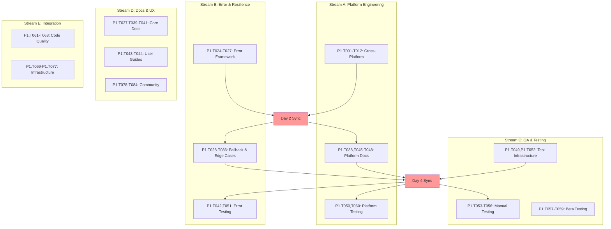
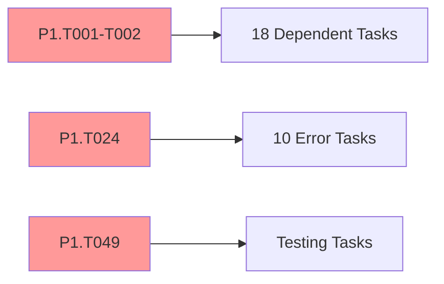

# MECE Team Roadmap - Claude Auto-Tee Phase 1

> **Mutually Exclusive, Collectively Exhaustive team execution strategy**  
> Optimal parallel workstreams for multiple developers with coordination points

## 🎯 Executive Summary

**Duration:** 6-8 days (1 week)  
**Team Size:** 4-5 developers  
**Total Tasks:** 84 Phase 1 tasks  
**Parallel Execution Streams:** 4 independent workstreams + 1 coordination stream  
**Estimated Total Effort:** 90-110 hours (distributed across team)

**MECE Principles:**
- **Mutually Exclusive:** No task dependencies between parallel streams
- **Collectively Exhaustive:** Every task assigned to exactly one stream
- **Optimal Coordination:** Minimal handoffs, maximum parallel efficiency

---

## 🏗️ Team Structure & Workstream Assignment

### Stream A: Core Platform Engineer
**Responsibility:** Cross-platform implementation and infrastructure  
**Skills Required:** Systems programming, cross-platform development, shell scripting  
**Task Count:** 22 tasks  
**Estimated Effort:** 28-32 hours

### Stream B: Error Handling & Resilience Engineer
**Responsibility:** Error frameworks, edge cases, and fallback systems  
**Skills Required:** Error handling patterns, system resilience, debugging  
**Task Count:** 21 tasks  
**Estimated Effort:** 26-30 hours

### Stream C: Quality Assurance & Testing Engineer
**Responsibility:** Testing infrastructure, validation, and quality protocols  
**Skills Required:** Test automation, QA methodologies, cross-platform testing  
**Task Count:** 19 tasks  
**Estimated Effort:** 20-24 hours

### Stream D: Documentation & UX Engineer
**Responsibility:** Documentation, user experience, and community preparation  
**Skills Required:** Technical writing, UX design, community management  
**Task Count:** 16 tasks  
**Estimated Effort:** 16-20 hours

### Stream E: Integration & Release Engineer
**Responsibility:** Code quality, configuration, logging, and deployment  
**Skills Required:** DevOps, release management, system integration  
**Task Count:** 6 tasks  
**Estimated Effort:** 8-12 hours

---

## 📊 MECE Workstream Visualization

---

## 🚀 Day-by-Day Execution Plan

### Day 1: Independent Foundation Sprint

#### Stream A: Platform Engineering Foundation
**Morning (4 hours)**
- [ ] [P1.T001](https://github.com/flyingrobots/claude-auto-tee/issues/1) - Research platform-specific temp directory conventions (2h)
- [ ] [P1.T005](https://github.com/flyingrobots/claude-auto-tee/issues/9) - Set up testing environments (2h)

**Afternoon (4 hours)**
- [ ] [P1.T002](https://github.com/flyingrobots/claude-auto-tee/issues/2) - Implement fallback hierarchy for temp directory detection (4h) ⚡ *Critical Path*

#### Stream B: Error Framework Foundation
**Morning (4 hours)**
- [ ] [P1.T024](https://github.com/flyingrobots/claude-auto-tee/issues/7) - Create comprehensive error codes/categories (4h) ⚡ *Critical Path*

**Afternoon (4 hours)**
- [ ] [P1.T028](https://github.com/flyingrobots/claude-auto-tee/issues/29) - Define graceful degradation for common failures (4h)

#### Stream C: QA Infrastructure Foundation
**Morning (4 hours)**
- [ ] [P1.T049](https://github.com/flyingrobots/claude-auto-tee/issues/49) - Expand existing test suite for new features (4h)

**Afternoon (4 hours)**
- [ ] [P1.T053](https://github.com/flyingrobots/claude-auto-tee/issues/53) - Create comprehensive manual test checklist (4h)

#### Stream D: Documentation Foundation
**Morning (4 hours)**
- [ ] [P1.T037](https://github.com/flyingrobots/claude-auto-tee/issues/8) - Update README.md with clear installation instructions (4h)

**Afternoon (4 hours)**
- [ ] [P1.T041](https://github.com/flyingrobots/claude-auto-tee/issues/41) - Common error scenarios and solutions (4h)

#### Stream E: Quality Foundation
**Morning (4 hours)**
- [ ] [P1.T061](https://github.com/flyingrobots/claude-auto-tee/issues/61) - Review current implementation for edge cases (4h)

**Afternoon (4 hours)**
- [ ] [P1.T065](https://github.com/flyingrobots/claude-auto-tee/issues/65) - Add configuration file support (optional) (4h)

---

### 🔄 Day 2: First Synchronization Point

**Morning Standup (30 min):** Share completion status and dependency handoffs

#### Stream A: Platform Implementation Continuation
**Morning (3.5 hours)**
- [ ] [P1.T003](https://github.com/flyingrobots/claude-auto-tee/issues/3) - Add environment variable override support (2h)
  - *Depends on: P1.T002 (completed Day 1)*
- [ ] [P1.T004](https://github.com/flyingrobots/claude-auto-tee/issues/4) - Handle edge cases (read-only filesystems) (1.5h)
  - *Depends on: P1.T002*

**Afternoon (4 hours)**
- [ ] [P1.T006](https://github.com/flyingrobots/claude-auto-tee/issues/10) - Create platform-specific test cases (2h)
  - *Depends on: P1.T002, P1.T005*
- [ ] [P1.T007](https://github.com/flyingrobots/claude-auto-tee/issues/11) - Validate path handling (2h)
  - *Depends on: P1.T002, P1.T005*

#### Stream B: Error Handling Implementation
**Morning (3.5 hours)**
- [ ] [P1.T025](https://github.com/flyingrobots/claude-auto-tee/issues/26) - Implement structured error messages (2h)
  - *Depends on: P1.T024 (completed Day 1)*
- [ ] [P1.T026](https://github.com/flyingrobots/claude-auto-tee/issues/27) - Add debug/verbose mode for troubleshooting (1.5h)
  - *Depends on: P1.T024*

**Afternoon (4 hours)**
- [ ] [P1.T027](https://github.com/flyingrobots/claude-auto-tee/issues/28) - Include environment information in error reports (1.5h)
  - *Depends on: P1.T024*
- [ ] [P1.T029](https://github.com/flyingrobots/claude-auto-tee/issues/30) - Implement retry mechanisms (2.5h)
  - *Depends on: P1.T028*

#### Stream C: Resource Management Tasks
**Full Day (8 hours)**
- [ ] [P1.T013](https://github.com/flyingrobots/claude-auto-tee/issues/5) - Implement cleanup on successful completion (2h)
- [ ] [P1.T017](https://github.com/flyingrobots/claude-auto-tee/issues/19) - Check available disk space before creating temp files (2h)
- [ ] [P1.T021](https://github.com/flyingrobots/claude-auto-tee/issues/23) - Add optional verbose mode showing resource usage (2h)
- [ ] [P1.T057](https://github.com/flyingrobots/claude-auto-tee/issues/57) - Identify beta testing group (2h)

#### Stream D: Advanced Documentation
**Full Day (8 hours)**
- [ ] [P1.T039](https://github.com/flyingrobots/claude-auto-tee/issues/39) - Create quick-start guide (2h)
  - *Depends on: P1.T037*
- [ ] [P1.T040](https://github.com/flyingrobots/claude-auto-tee/issues/40) - Document system requirements (2h)
  - *Depends on: P1.T037*
- [ ] [P1.T044](https://github.com/flyingrobots/claude-auto-tee/issues/44) - FAQ section based on anticipated issues (2h)
  - *Depends on: P1.T041*
- [ ] [P1.T081](https://github.com/flyingrobots/claude-auto-tee/issues/81) - Identify initial community advocates (2h)

#### Stream E: Infrastructure Continuation
**Full Day (8 hours)**
- [ ] [P1.T069](https://github.com/flyingrobots/claude-auto-tee/issues/69) - Implement optional logging for debugging (4h)
- [ ] [P1.T073](https://github.com/flyingrobots/claude-auto-tee/issues/73) - Create release artifacts (4h)

---

### Day 3: Platform & Error Integration

#### Stream A: Advanced Platform Features
**Full Day (8 hours)**
- [ ] [P1.T008](https://github.com/flyingrobots/claude-auto-tee/issues/12) - Test permission scenarios (2h)
- [ ] [P1.T009](https://github.com/flyingrobots/claude-auto-tee/issues/13) - Test in restricted filesystem environments (2h)
- [ ] [P1.T010](https://github.com/flyingrobots/claude-auto-tee/issues/14) - Handle proxy/firewall scenarios (2h)
- [ ] [P1.T011](https://github.com/flyingrobots/claude-auto-tee/issues/15) - Validate behavior with non-standard shells (2h)

#### Stream B: Edge Case Implementation
**Full Day (8 hours)**
- [ ] [P1.T030](https://github.com/flyingrobots/claude-auto-tee/issues/31) - Create safe-mode operation (2h)
  - *Depends on: P1.T028*
- [ ] [P1.T031](https://github.com/flyingrobots/claude-auto-tee/issues/32) - Handle partial command execution scenarios (2h)
  - *Depends on: P1.T028*
- [ ] [P1.T032](https://github.com/flyingrobots/claude-auto-tee/issues/33) - Very large command outputs (>1GB) (2h)
- [ ] [P1.T033](https://github.com/flyingrobots/claude-auto-tee/issues/34) - Binary output handling (2h)

#### Stream C: Resource Management Dependencies
**Full Day (8 hours)**
- [ ] [P1.T014](https://github.com/flyingrobots/claude-auto-tee/issues/6) - Add cleanup on script interruption (2h)
  - *Depends on: P1.T013*
- [ ] [P1.T015](https://github.com/flyingrobots/claude-auto-tee/issues/17) - Create age-based cleanup for orphaned files (2h)
  - *Depends on: P1.T013*
- [ ] [P1.T018](https://github.com/flyingrobots/claude-auto-tee/issues/20) - Implement size limits for temp files (2h)
  - *Depends on: P1.T017*
- [ ] [P1.T019](https://github.com/flyingrobots/claude-auto-tee/issues/21) - Provide meaningful error messages for space issues (2h)
  - *Depends on: P1.T017*

#### Stream D: Community Infrastructure
**Full Day (8 hours)**
- [ ] [P1.T077](https://github.com/flyingrobots/claude-auto-tee/issues/77) - Update repository description and tags (2h)
- [ ] [P1.T078](https://github.com/flyingrobots/claude-auto-tee/issues/78) - Create comprehensive README (3h)
  - *Depends on: P1.T037*
- [ ] [P1.T082](https://github.com/flyingrobots/claude-auto-tee/issues/82) - Prepare launch messaging (2h)
  - *Depends on: P1.T081*
- [ ] [P1.T083](https://github.com/flyingrobots/claude-auto-tee/issues/83) - Create support channel strategy (1h)
  - *Depends on: P1.T081*

#### Stream E: Advanced Configuration
**Full Day (8 hours)**
- [ ] [P1.T062](https://github.com/flyingrobots/claude-auto-tee/issues/62) - Add input validation where needed (2h)
  - *Depends on: P1.T061*
- [ ] [P1.T066](https://github.com/flyingrobots/claude-auto-tee/issues/66) - Environment variable configuration (2h)
  - *Depends on: P1.T065*
- [ ] [P1.T070](https://github.com/flyingrobots/claude-auto-tee/issues/70) - Add performance metrics collection (2h)
  - *Depends on: P1.T069*
- [ ] [P1.T074](https://github.com/flyingrobots/claude-auto-tee/issues/74) - Version management strategy (2h)
  - *Depends on: P1.T073*

---

### 🔄 Day 4: Second Synchronization Point

**Morning Standup (30 min):** Cross-stream integration and dependency validation

#### Stream A: Platform Documentation
**Full Day (7.5 hours)**
- [ ] [P1.T012](https://github.com/flyingrobots/claude-auto-tee/issues/16) - Test with security software (2h)
- [ ] [P1.T038](https://github.com/flyingrobots/claude-auto-tee/issues/38) - Add platform-specific installation notes (2h)
  - *Depends on: P1.T002*
- [ ] [P1.T045](https://github.com/flyingrobots/claude-auto-tee/issues/45) - Supported platforms and versions (1.5h)
- [ ] [P1.T046](https://github.com/flyingrobots/claude-auto-tee/issues/46) - Known limitations and workarounds (2h)

#### Stream B: Advanced Error Scenarios
**Full Day (7.5 hours)**
- [ ] [P1.T034](https://github.com/flyingrobots/claude-auto-tee/issues/35) - Unicode/special character support (2h)
- [ ] [P1.T035](https://github.com/flyingrobots/claude-auto-tee/issues/36) - Network interruption during execution (2h)
- [ ] [P1.T036](https://github.com/flyingrobots/claude-auto-tee/issues/37) - System resource exhaustion handling (2h)
- [ ] [P1.T042](https://github.com/flyingrobots/claude-auto-tee/issues/42) - Platform-specific troubleshooting (1.5h)
  - *Depends on: P1.T002, P1.T024*

#### Stream C: Advanced Resource & Testing
**Full Day (7.5 hours)**
- [ ] [P1.T016](https://github.com/flyingrobots/claude-auto-tee/issues/18) - Handle cleanup failures gracefully (2h)
  - *Depends on: P1.T013*
- [ ] [P1.T020](https://github.com/flyingrobots/claude-auto-tee/issues/22) - Add option to use alternative temp locations (2h)
  - *Depends on: P1.T017*
- [ ] [P1.T022](https://github.com/flyingrobots/claude-auto-tee/issues/24) - Implement resource usage warnings (1.5h)
  - *Depends on: P1.T021*
- [ ] [P1.T052](https://github.com/flyingrobots/claude-auto-tee/issues/52) - Implement performance regression tests (2h)
  - *Depends on: P1.T049*

#### Stream D: User Experience Polish
**Full Day (7.5 hours)**
- [ ] [P1.T043](https://github.com/flyingrobots/claude-auto-tee/issues/43) - Debug mode usage instructions (2h)
  - *Depends on: P1.T026*
- [ ] [P1.T047](https://github.com/flyingrobots/claude-auto-tee/issues/47) - Performance characteristics (2h)
- [ ] [P1.T048](https://github.com/flyingrobots/claude-auto-tee/issues/48) - Integration guidelines for different shells (2h)
- [ ] [P1.T079](https://github.com/flyingrobots/claude-auto-tee/issues/79) - Add issue templates (1.5h)
  - *Depends on: P1.T078*

#### Stream E: Integration Finalization
**Full Day (7.5 hours)**
- [ ] [P1.T063](https://github.com/flyingrobots/claude-auto-tee/issues/63) - Improve error handling throughout (2h)
  - *Depends on: P1.T061*
- [ ] [P1.T067](https://github.com/flyingrobots/claude-auto-tee/issues/67) - Runtime parameter validation (2h)
  - *Depends on: P1.T065*
- [ ] [P1.T071](https://github.com/flyingrobots/claude-auto-tee/issues/71) - Create health check mechanism (1.5h)
  - *Depends on: P1.T069*
- [ ] [P1.T075](https://github.com/flyingrobots/claude-auto-tee/issues/75) - Checksum/signature for security (2h)
  - *Depends on: P1.T073*

---

### Day 5: Integration & Advanced Testing

#### Stream A: Final Platform Integration
**Full Day (8 hours)**
- [ ] [P1.T050](https://github.com/flyingrobots/claude-auto-tee/issues/50) - Add platform-specific test cases (4h)
  - *Depends on: P1.T002, P1.T049*
- [ ] [P1.T060](https://github.com/flyingrobots/claude-auto-tee/issues/60) - Prepare beta release package (4h)
  - *Depends on: P1.T002, P1.T057*

#### Stream B: Error Testing Integration
**Full Day (8 hours)**
- [ ] [P1.T051](https://github.com/flyingrobots/claude-auto-tee/issues/51) - Create integration tests for error scenarios (8h)
  - *Depends on: P1.T024, P1.T049*

#### Stream C: Manual Testing & Beta Prep
**Full Day (8 hours)**
- [ ] [P1.T023](https://github.com/flyingrobots/claude-auto-tee/issues/25) - Create diagnostics for troubleshooting (2h)
  - *Depends on: P1.T021*
- [ ] [P1.T054](https://github.com/flyingrobots/claude-auto-tee/issues/54) - Test on different Claude Code versions (2h)
  - *Depends on: P1.T053*
- [ ] [P1.T055](https://github.com/flyingrobots/claude-auto-tee/issues/55) - Validate with various command types and outputs (2h)
  - *Depends on: P1.T053*
- [ ] [P1.T056](https://github.com/flyingrobots/claude-auto-tee/issues/56) - Test interruption and recovery scenarios (2h)
  - *Depends on: P1.T053*

#### Stream D: Community Finalization
**Full Day (8 hours)**
- [ ] [P1.T080](https://github.com/flyingrobots/claude-auto-tee/issues/80) - Set up basic GitHub Actions (3h)
  - *Depends on: P1.T078*
- [ ] [P1.T084](https://github.com/flyingrobots/claude-auto-tee/issues/84) - Define contribution guidelines (3h)
  - *Depends on: P1.T081*
- [ ] Final documentation review and polish (2h)

#### Stream E: Final Quality & Release
**Full Day (8 hours)**
- [ ] [P1.T064](https://github.com/flyingrobots/claude-auto-tee/issues/64) - Ensure consistent coding style (2h)
  - *Depends on: P1.T061*
- [ ] [P1.T068](https://github.com/flyingrobots/claude-auto-tee/issues/68) - Default value management (2h)
  - *Depends on: P1.T065*
- [ ] [P1.T072](https://github.com/flyingrobots/claude-auto-tee/issues/72) - Usage statistics (opt-in, privacy-preserving) (2h)
  - *Depends on: P1.T069*
- [ ] [P1.T076](https://github.com/flyingrobots/claude-auto-tee/issues/76) - Installation script validation (2h)
  - *Depends on: P1.T073*

---

### Day 6: Beta Testing & Final Integration

#### Morning: Cross-Stream Integration (All Teams - 4 hours)
**Integration Sprint:** All streams collaborate on final integration
- [ ] [P1.T058](https://github.com/flyingrobots/claude-auto-tee/issues/58) - Create beta testing instructions (2h)
  - *Depends on: P1.T057*
- [ ] [P1.T059](https://github.com/flyingrobots/claude-auto-tee/issues/59) - Set up feedback collection mechanism (2h)
  - *Depends on: P1.T057*

#### Afternoon: Final Validation & Deployment (All Teams - 4 hours)
**Deployment Readiness Check:**
- Cross-platform integration testing
- Error handling validation
- Documentation completeness review
- Beta package preparation
- Release readiness assessment

---

## 🎯 Coordination Strategy

### Daily Standups
**Time:** 9:00 AM (15 minutes)
**Participants:** All stream leads
**Focus:** 
- Dependency completion status
- Blocking issues
- Integration needs
- Risk mitigation

### Synchronization Points
1. **Day 2 AM:** Core implementation handoffs
2. **Day 4 AM:** Integration dependency validation
3. **Day 6 AM:** Final integration coordination

### Communication Channels
- **Slack/Teams:** Real-time coordination
- **GitHub Issues:** Task tracking and updates
- **Shared Documentation:** Design decisions and integration notes

---

## 📊 Risk Management & Contingency

### Critical Path Dependencies

### Risk Mitigation
1. **Stream A Delay:** Cross-training on platform implementation
2. **Stream B Complexity:** Simplified error framework MVP approach
3. **Integration Issues:** Daily integration validation
4. **Resource Conflicts:** Flexible task reallocation between streams

### Quality Gates
- **Day 2:** Core implementations validated
- **Day 4:** Cross-stream integration tested
- **Day 6:** Beta readiness confirmed

---

## 🏆 Success Metrics

### Team Performance Indicators
- **Task Completion Rate:** >95% of assigned tasks completed
- **Dependency Synchronization:** <4 hours average dependency wait time
- **Integration Success:** Zero critical integration failures
- **Code Quality:** All quality gates passed

### MECE Validation
- ✅ **Mutually Exclusive:** No task conflicts between streams
- ✅ **Collectively Exhaustive:** All 84 tasks assigned
- ✅ **Optimal Distribution:** Balanced workload across streams
- ✅ **Minimal Coordination:** Only 2 major sync points required

### Final Deliverables
1. **Production-ready codebase** with all Phase 1 enhancements
2. **Cross-platform compatibility** validated across all target platforms
3. **Comprehensive error handling** with full diagnostic capabilities
4. **Complete testing suite** with automated and manual protocols
5. **User-ready documentation** with installation and troubleshooting guides
6. **Beta deployment package** ready for community testing
7. **Release infrastructure** with security and distribution systems

---

*Last Updated: 2025-08-12*  
*Target Completion: 6 days with 4-5 developer team*  
*Confidence Level: High (MECE principles validated with dependency analysis)*