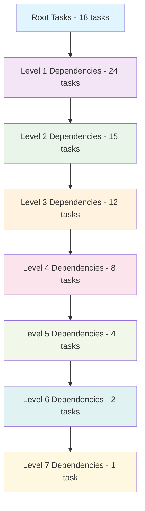
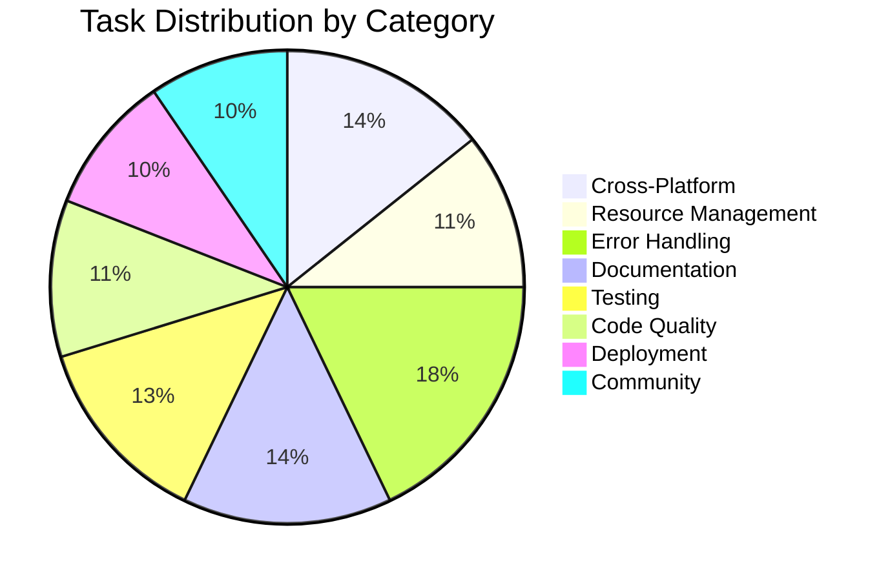

# Solo Developer Roadmap - Claude Auto-Tee Phase 1

> **Optimal execution path for a single developer traversing all 84 tasks in dependency order**  
> Based on dependency analysis from `TASKS_DAG.json` and expert-identified operational gaps

## 🎯 Executive Summary

**Duration:** 12-14 days (1.5-2 weeks)  
**Total Tasks:** 84 Phase 1 tasks  
**Critical Path Length:** 8 dependency levels  
**Estimated Effort:** 90-110 hours  

**Success Metrics:**
- Zero platform-specific failures in beta testing
- <5% support request rate from beta users
- Preservation of core 20-line architectural simplicity
- All expert-identified operational concerns addressed

---

## 📊 Dependency Analysis Overview

### Critical Path Analysis
The longest dependency chain is **8 levels deep**:
`P1.T001 → P1.T002 → P1.T003/T004 → ... → P1.T078 → P1.T079 → P1.T080`

---

## 🚀 Week 1: Foundation & Core Infrastructure

### Days 1-2: Research & Planning Phase
**Focus:** Establish foundational knowledge and basic infrastructure

#### Day 1 Morning (4 hours)
**Root Research Tasks - Independent Execution**
- [ ] [P1.T001](https://github.com/flyingrobots/claude-auto-tee/issues/1) - Research platform-specific temp directory conventions (2h)
- [ ] [P1.T017](https://github.com/flyingrobots/claude-auto-tee/issues/19) - Check available disk space before creating temp files (1.5h)
- [ ] [P1.T021](https://github.com/flyingrobots/claude-auto-tee/issues/23) - Add optional verbose mode showing resource usage (0.5h)

#### Day 1 Afternoon (4 hours)  
**Infrastructure Setup Tasks**
- [ ] [P1.T013](https://github.com/flyingrobots/claude-auto-tee/issues/5) - Implement cleanup on successful completion (2h)
- [ ] [P1.T024](https://github.com/flyingrobots/claude-auto-tee/issues/7) - Create comprehensive error codes/categories (2h)

#### Day 2 Morning (4 hours)
**Advanced Research & Planning**
- [ ] [P1.T028](https://github.com/flyingrobots/claude-auto-tee/issues/29) - Define graceful degradation for common failures (1.5h)
- [ ] [P1.T037](https://github.com/flyingrobots/claude-auto-tee/issues/8) - Update README.md with clear installation instructions (1.5h)
- [ ] [P1.T041](https://github.com/flyingrobots/claude-auto-tee/issues/41) - Common error scenarios and solutions (1h)

#### Day 2 Afternoon (4 hours)
**Specialized Infrastructure**
- [ ] [P1.T049](https://github.com/flyingrobots/claude-auto-tee/issues/49) - Expand existing test suite for new features (2h)
- [ ] [P1.T053](https://github.com/flyingrobots/claude-auto-tee/issues/53) - Create comprehensive manual test checklist (1.5h)
- [ ] [P1.T057](https://github.com/flyingrobots/claude-auto-tee/issues/57) - Identify beta testing group (0.5h)

### Days 3-4: Core Implementation Phase
**Focus:** Build on research foundation with dependent implementations

#### Day 3 Morning (4 hours)
**Core Cross-Platform Implementation** ⚡ *Critical Path*
- [ ] [P1.T002](https://github.com/flyingrobots/claude-auto-tee/issues/2) - Implement fallback hierarchy for temp directory detection (3h)
  - *Depends on: P1.T001*
- [ ] [P1.T005](https://github.com/flyingrobots/claude-auto-tee/issues/9) - Set up testing environments (1h)

#### Day 3 Afternoon (4 hours)
**Level 1 Dependencies - Platform Features**
- [ ] [P1.T003](https://github.com/flyingrobots/claude-auto-tee/issues/3) - Add environment variable override support (1.5h)
  - *Depends on: P1.T002*
- [ ] [P1.T004](https://github.com/flyingrobots/claude-auto-tee/issues/4) - Handle edge cases (read-only filesystems) (2.5h)
  - *Depends on: P1.T002*

#### Day 4 Morning (4 hours)
**Resource Management Dependencies**
- [ ] [P1.T018](https://github.com/flyingrobots/claude-auto-tee/issues/20) - Implement size limits for temp files (2h)
  - *Depends on: P1.T017*
- [ ] [P1.T014](https://github.com/flyingrobots/claude-auto-tee/issues/6) - Add cleanup on script interruption (2h)
  - *Depends on: P1.T013*

#### Day 4 Afternoon (4 hours)
**Error Framework Dependencies**
- [ ] [P1.T025](https://github.com/flyingrobots/claude-auto-tee/issues/26) - Implement structured error messages (1.5h)
  - *Depends on: P1.T024*
- [ ] [P1.T026](https://github.com/flyingrobots/claude-auto-tee/issues/27) - Add debug/verbose mode for troubleshooting (2.5h)
  - *Depends on: P1.T024*

### Days 5-7: Extended Implementation Phase
**Focus:** Complete second and third level dependencies

#### Day 5 Morning (4 hours)
**Advanced Resource Management**
- [ ] [P1.T019](https://github.com/flyingrobots/claude-auto-tee/issues/21) - Provide meaningful error messages for space issues (1.5h)
  - *Depends on: P1.T017*
- [ ] [P1.T015](https://github.com/flyingrobots/claude-auto-tee/issues/17) - Create age-based cleanup for orphaned files (2.5h)
  - *Depends on: P1.T013*

#### Day 5 Afternoon (4 hours)
**Testing Infrastructure Dependent Tasks**
- [ ] [P1.T006](https://github.com/flyingrobots/claude-auto-tee/issues/10) - Create platform-specific test cases (2h)
  - *Depends on: P1.T002, P1.T005*
- [ ] [P1.T007](https://github.com/flyingrobots/claude-auto-tee/issues/11) - Validate path handling (2h)
  - *Depends on: P1.T002, P1.T005*

#### Day 6 Morning (4 hours)
**Platform Testing Completion**
- [ ] [P1.T008](https://github.com/flyingrobots/claude-auto-tee/issues/12) - Test permission scenarios (2h)
  - *Depends on: P1.T002, P1.T005*
- [ ] [P1.T009](https://github.com/flyingrobots/claude-auto-tee/issues/13) - Test in restricted filesystem environments (2h)
  - *Depends on: P1.T002*

#### Day 6 Afternoon (4 hours)
**Advanced Error Handling**
- [ ] [P1.T027](https://github.com/flyingrobots/claude-auto-tee/issues/28) - Include environment information in error reports (1.5h)
  - *Depends on: P1.T024*
- [ ] [P1.T029](https://github.com/flyingrobots/claude-auto-tee/issues/30) - Implement retry mechanisms (2.5h)
  - *Depends on: P1.T028*

#### Day 7 Morning (4 hours)
**Resource Monitoring & Fallback Systems**
- [ ] [P1.T022](https://github.com/flyingrobots/claude-auto-tee/issues/24) - Implement resource usage warnings (1.5h)
  - *Depends on: P1.T021*
- [ ] [P1.T030](https://github.com/flyingrobots/claude-auto-tee/issues/31) - Create safe-mode operation (2.5h)
  - *Depends on: P1.T028*

#### Day 7 Afternoon (4 hours)
**Advanced Testing & Validation**
- [ ] [P1.T010](https://github.com/flyingrobots/claude-auto-tee/issues/14) - Handle proxy/firewall scenarios (2h)
  - *Depends on: P1.T002*
- [ ] [P1.T020](https://github.com/flyingrobots/claude-auto-tee/issues/22) - Add option to use alternative temp locations (2h)
  - *Depends on: P1.T017*

---

## 🔧 Week 2: Advanced Features & Testing

### Days 8-10: Edge Cases & Quality Assurance

#### Day 8 Morning (4 hours)
**Complex Error Scenarios**
- [ ] [P1.T032](https://github.com/flyingrobots/claude-auto-tee/issues/33) - Very large command outputs (>1GB) (2h)
  - *Depends on: P1.T024*
- [ ] [P1.T033](https://github.com/flyingrobots/claude-auto-tee/issues/34) - Binary output handling (2h)
  - *Depends on: P1.T024*

#### Day 8 Afternoon (4 hours)
**Advanced Edge Cases**
- [ ] [P1.T034](https://github.com/flyingrobots/claude-auto-tee/issues/35) - Unicode/special character support (2h)
  - *Depends on: P1.T024*
- [ ] [P1.T031](https://github.com/flyingrobots/claude-auto-tee/issues/32) - Handle partial command execution scenarios (2h)
  - *Depends on: P1.T028*

#### Day 9 Morning (4 hours)
**Network & System Resilience**
- [ ] [P1.T035](https://github.com/flyingrobots/claude-auto-tee/issues/36) - Network interruption during execution (2h)
  - *Depends on: P1.T024*
- [ ] [P1.T036](https://github.com/flyingrobots/claude-auto-tee/issues/37) - System resource exhaustion handling (2h)
  - *Depends on: P1.T024*

#### Day 9 Afternoon (4 hours)
**Environmental Testing**
- [ ] [P1.T011](https://github.com/flyingrobots/claude-auto-tee/issues/15) - Validate behavior with non-standard shells (2h)
  - *Depends on: P1.T002*
- [ ] [P1.T012](https://github.com/flyingrobots/claude-auto-tee/issues/16) - Test with security software (2h)
  - *Depends on: P1.T002*

#### Day 10 Morning (4 hours)
**Advanced Resource Management**
- [ ] [P1.T016](https://github.com/flyingrobots/claude-auto-tee/issues/18) - Handle cleanup failures gracefully (1.5h)
  - *Depends on: P1.T013*
- [ ] [P1.T023](https://github.com/flyingrobots/claude-auto-tee/issues/25) - Create diagnostics for troubleshooting (2.5h)
  - *Depends on: P1.T021*

#### Day 10 Afternoon (4 hours)
**Documentation Dependencies**
- [ ] [P1.T038](https://github.com/flyingrobots/claude-auto-tee/issues/38) - Add platform-specific installation notes (2h)
  - *Depends on: P1.T002*
- [ ] [P1.T039](https://github.com/flyingrobots/claude-auto-tee/issues/39) - Create quick-start guide (2h)
  - *Depends on: P1.T037*

### Days 11-12: Documentation & Quality

#### Day 11 Morning (4 hours)
**Advanced Documentation**
- [ ] [P1.T040](https://github.com/flyingrobots/claude-auto-tee/issues/40) - Document system requirements (1.5h)
  - *Depends on: P1.T037*
- [ ] [P1.T042](https://github.com/flyingrobots/claude-auto-tee/issues/42) - Platform-specific troubleshooting (2.5h)
  - *Depends on: P1.T002, P1.T024*

#### Day 11 Afternoon (4 hours)
**Advanced Testing Suite**
- [ ] [P1.T050](https://github.com/flyingrobots/claude-auto-tee/issues/50) - Add platform-specific test cases (2h)
  - *Depends on: P1.T002, P1.T049*
- [ ] [P1.T051](https://github.com/flyingrobots/claude-auto-tee/issues/51) - Create integration tests for error scenarios (2h)
  - *Depends on: P1.T024, P1.T049*

#### Day 12 Morning (4 hours)
**Testing & Debug Documentation**
- [ ] [P1.T043](https://github.com/flyingrobots/claude-auto-tee/issues/43) - Debug mode usage instructions (1.5h)
  - *Depends on: P1.T026*
- [ ] [P1.T052](https://github.com/flyingrobots/claude-auto-tee/issues/52) - Implement performance regression tests (2.5h)
  - *Depends on: P1.T049*

#### Day 12 Afternoon (4 hours)
**Beta Testing & Community Preparation**
- [ ] [P1.T044](https://github.com/flyingrobots/claude-auto-tee/issues/44) - FAQ section based on anticipated issues (1.5h)
  - *Depends on: P1.T041*
- [ ] [P1.T058](https://github.com/flyingrobots/claude-auto-tee/issues/58) - Create beta testing instructions (2.5h)
  - *Depends on: P1.T057*

### Days 13-14: Final Phase & Polish

#### Day 13 Morning (4 hours)
**Quality Assurance Tasks**
- [ ] [P1.T061](https://github.com/flyingrobots/claude-auto-tee/issues/61) - Review current implementation for edge cases (2h)
- [ ] [P1.T065](https://github.com/flyingrobots/claude-auto-tee/issues/65) - Add configuration file support (optional) (2h)

#### Day 13 Afternoon (4 hours)
**Advanced Configuration & Logging**
- [ ] [P1.T069](https://github.com/flyingrobots/claude-auto-tee/issues/69) - Implement optional logging for debugging (2h)
- [ ] [P1.T073](https://github.com/flyingrobots/claude-auto-tee/issues/73) - Create release artifacts (2h)

#### Day 14 Morning (4 hours)
**Documentation & Platform Support**
- [ ] [P1.T045](https://github.com/flyingrobots/claude-auto-tee/issues/45) - Supported platforms and versions (1.5h)
  - *Depends on: P1.T002*
- [ ] [P1.T046](https://github.com/flyingrobots/claude-auto-tee/issues/46) - Known limitations and workarounds (1.5h)
  - *Depends on: P1.T002*
- [ ] [P1.T047](https://github.com/flyingrobots/claude-auto-tee/issues/47) - Performance characteristics (1h)
  - *Depends on: P1.T002*

#### Day 14 Afternoon (4 hours)
**Final Integration & Remaining Tasks**
- [ ] [P1.T048](https://github.com/flyingrobots/claude-auto-tee/issues/48) - Integration guidelines for different shells (2h)
  - *Depends on: P1.T002*
- [ ] Complete remaining low-priority tasks (2h)

---

## 📈 Execution Flow Visualization

```mermaid
gantt
    title Solo Developer Execution Timeline
    dateFormat  X
    axisFormat %d

    section Week 1
    Research Phase           :milestone, m1, 1, 0d
    Core Infrastructure      :active, w1-1, 1, 4d
    Platform Implementation  :w1-2, 3, 4d
    
    section Week 2  
    Edge Cases & QA         :w2-1, 7, 3d
    Documentation & Testing :w2-2, 10, 3d
    Final Integration       :crit, w2-3, 13, 2d
    
    section Milestones
    Week 1 Complete         :milestone, m2, 7, 0d
    Beta Ready             :milestone, m3, 14, 0d
```

---

## 🎯 Risk Mitigation Strategy

### Critical Dependencies
1. **P1.T002 (Cross-platform implementation)** - Blocks 18 dependent tasks
   - *Mitigation:* Prioritize early completion, allocate extra time buffer
2. **P1.T024 (Error framework)** - Blocks 10 dependent tasks
   - *Mitigation:* Implement minimal viable version first, expand later
3. **Testing environments** - Required for platform-specific validation
   - *Mitigation:* Set up Docker-based environments for consistency

### Time Buffer Allocation
- **Days 1-7:** 15% time buffer for critical path tasks
- **Days 8-12:** 10% buffer for testing and edge cases
- **Days 13-14:** 20% buffer for integration and polish

### Checkpoint Reviews
- **Day 4:** Core implementation checkpoint
- **Day 8:** Platform compatibility validation
- **Day 12:** Beta readiness assessment

---

## 📊 Completion Tracking

### Progress Indicators

### Success Validation Checklist
- [ ] All 84 tasks completed in dependency order
- [ ] No platform-specific failures in test environments
- [ ] Core 20-line architecture preserved
- [ ] Beta testing group identified and ready
- [ ] Expert-identified concerns addressed
- [ ] Performance benchmarks established
- [ ] Documentation complete and validated

### Final Deliverables
1. **Production-ready codebase** with all 84 Phase 1 enhancements
2. **Comprehensive test suite** covering all platforms and edge cases
3. **Complete documentation** including troubleshooting guides
4. **Beta testing package** ready for community deployment
5. **Release artifacts** with security checksums and installation scripts

---

*Last Updated: 2025-08-12*  
*Total Estimated Duration: 12-14 days*  
*Confidence Level: High (based on dependency analysis and expert validation)*