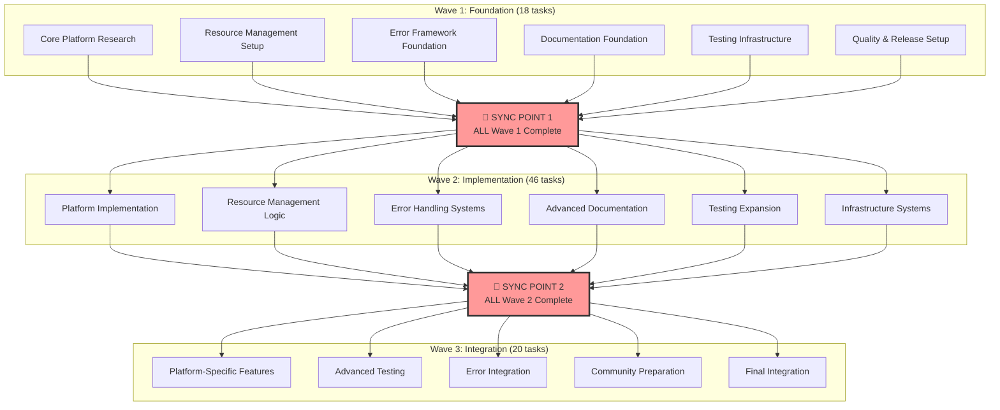

# Wave-Based Execution Roadmap - Claude Auto-Tee Phase 1

> **Thread.join() Style Execution Model**  
> Clean wave-based approach with complete independence within waves and hard synchronization between waves

## 🎯 Executive Summary

**Execution Model:** Wave-based with thread.join() synchronization  
**Total Waves:** 3 dependency levels  
**Total Tasks:** 84 Phase 1 tasks  
**Team Scaling:** Supports 3-15+ teams working completely independently within each wave  
**Duration:** 4-7 days (depending on team size and parallel execution)

**Key Principles:**
- **Within Wave:** Complete independence - zero coordination required between teams
- **Between Waves:** Hard synchronization barrier - ALL teams must complete current wave before ANY team starts next wave
- **Team Assignment:** Teams can pick up any available task within their current wave
- **Scaling:** More teams = faster wave completion, but same total number of waves

---

## 🌊 Wave Structure Overview

---

## 🌊 Wave 1: Foundation (18 Tasks)

**Duration:** 1-2 days  
**Parallelization:** All 18 tasks are completely independent  
**Team Capacity:** Can support 3-6 teams working simultaneously

### Wave 1 Characteristics
- **Zero Dependencies:** All tasks can start immediately
- **Research & Setup:** Foundation work that enables everything else
- **Pure Parallel Execution:** No coordination needed between any tasks

### Wave 1 Task Categories

#### Core Platform Research (1 task)
- **P1.T001** - Research platform-specific temp directory conventions

#### Resource Management Foundation (3 tasks)  
- **P1.T013** - Implement cleanup on successful completion
- **P1.T017** - Check available disk space before creating temp files
- **P1.T021** - Add optional verbose mode showing resource usage

#### Error Framework Foundation (2 tasks)
- **P1.T024** - Create comprehensive error codes/categories
- **P1.T028** - Define graceful degradation for common failures

#### Documentation Foundation (2 tasks)
- **P1.T037** - Update README.md with clear installation instructions  
- **P1.T041** - Common error scenarios and solutions

#### Testing Infrastructure (3 tasks)
- **P1.T005** - Set up testing environments
- **P1.T049** - Expand existing test suite for new features
- **P1.T053** - Create comprehensive manual test checklist

#### Quality & Release Setup (7 tasks)
- **P1.T057** - Identify beta testing group
- **P1.T061** - Review current implementation for edge cases
- **P1.T065** - Add configuration file support (optional)
- **P1.T069** - Implement optional logging for debugging
- **P1.T073** - Create release artifacts
- **P1.T077** - Update repository description and tags
- **P1.T081** - Identify initial community advocates

### Wave 1 Execution Strategy

**Team Distribution Options:**

#### Option A: 3 Teams (6 tasks each)
- **Team Alpha:** P1.T001, P1.T013, P1.T024, P1.T037, P1.T049, P1.T061
- **Team Beta:** P1.T017, P1.T028, P1.T041, P1.T005, P1.T053, P1.T065  
- **Team Gamma:** P1.T021, P1.T057, P1.T069, P1.T073, P1.T077, P1.T081

#### Option B: 6 Teams (3 tasks each)
- **Team 1:** P1.T001, P1.T013, P1.T024
- **Team 2:** P1.T017, P1.T028, P1.T037
- **Team 3:** P1.T021, P1.T041, P1.T005
- **Team 4:** P1.T049, P1.T053, P1.T057
- **Team 5:** P1.T061, P1.T065, P1.T069
- **Team 6:** P1.T073, P1.T077, P1.T081

### 🔄 Sync Point 1: Wave 1 → Wave 2 Transition

**Sync Criteria:** ALL 18 Wave 1 tasks must be completed before ANY Wave 2 task begins  
**Validation:** Core foundations are ready for implementation phase  
**Duration:** 30-60 minutes for verification and handoff

---

## 🌊 Wave 2: Implementation (46 Tasks)

**Duration:** 2-3 days  
**Parallelization:** All 46 tasks are completely independent (dependencies satisfied by Wave 1)  
**Team Capacity:** Can support 8-15+ teams working simultaneously

### Wave 2 Characteristics
- **Wave 1 Dependencies:** All depend only on completed Wave 1 tasks
- **Core Implementation:** Primary feature development and system building
- **Massive Parallelization:** Highest task count enables maximum team scaling

### Wave 2 Task Categories

#### Platform Implementation (15 tasks)
**Depends on:** P1.T001, P1.T005, P1.T024 (Wave 1 complete)
- **P1.T002** - Implement fallback hierarchy for temp directory detection
- **P1.T014** - Add cleanup on script interruption
- **P1.T015** - Create age-based cleanup for orphaned files
- **P1.T016** - Handle cleanup failures gracefully
- **P1.T018** - Implement size limits for temp files
- **P1.T019** - Provide meaningful error messages for space issues
- **P1.T020** - Add option to use alternative temp locations
- **P1.T022** - Implement resource usage warnings
- **P1.T023** - Create diagnostics for troubleshooting
- **P1.T025** - Implement structured error messages
- **P1.T026** - Add debug/verbose mode for troubleshooting
- **P1.T027** - Include environment information in error reports
- **P1.T029** - Implement retry mechanisms
- **P1.T030** - Create safe-mode operation
- **P1.T031** - Handle partial command execution scenarios

#### Error Handling Systems (11 tasks)
**Depends on:** P1.T024, P1.T028 (Wave 1 complete)
- **P1.T032** - Very large command outputs (>1GB)
- **P1.T033** - Binary output handling
- **P1.T034** - Unicode/special character support
- **P1.T035** - Network interruption during execution
- **P1.T036** - System resource exhaustion handling
- **P1.T051** - Create integration tests for error scenarios
- **P1.T052** - Implement performance regression tests
- **P1.T062** - Add input validation where needed
- **P1.T063** - Improve error handling throughout
- **P1.T064** - Ensure consistent coding style
- **P1.T070** - Add performance metrics collection

#### Advanced Documentation (6 tasks)
**Depends on:** P1.T037, P1.T041 (Wave 1 complete)
- **P1.T039** - Create quick-start guide
- **P1.T040** - Document system requirements
- **P1.T044** - FAQ section based on anticipated issues
- **P1.T078** - Create comprehensive README
- **P1.T082** - Prepare launch messaging
- **P1.T083** - Create support channel strategy

#### Testing Expansion (6 tasks)
**Depends on:** P1.T049, P1.T053 (Wave 1 complete)
- **P1.T054** - Test on different Claude Code versions
- **P1.T055** - Validate with various command types and outputs
- **P1.T056** - Test interruption and recovery scenarios
- **P1.T058** - Create beta testing instructions
- **P1.T059** - Set up feedback collection mechanism
- **P1.T071** - Create health check mechanism

#### Infrastructure Systems (8 tasks)
**Depends on:** P1.T061, P1.T065, P1.T069, P1.T073, P1.T081 (Wave 1 complete)
- **P1.T066** - Environment variable configuration
- **P1.T067** - Runtime parameter validation
- **P1.T068** - Default value management
- **P1.T072** - Usage statistics (opt-in, privacy-preserving)
- **P1.T074** - Version management strategy
- **P1.T075** - Checksum/signature for security
- **P1.T076** - Installation script validation
- **P1.T084** - Define contribution guidelines

### Wave 2 Execution Strategy

**Team Distribution Options:**

#### Option A: High Specialization (5 Teams)
- **Platform Team (15 tasks):** 3 developers, 2-3 days
- **Error Team (11 tasks):** 2-3 developers, 2-3 days  
- **Docs Team (6 tasks):** 1-2 developers, 2-3 days
- **Testing Team (6 tasks):** 1-2 developers, 2-3 days
- **Infrastructure Team (8 tasks):** 2 developers, 2-3 days

#### Option B: Balanced Load (10+ Teams)
- **Teams 1-3:** Platform Implementation (5 tasks each)
- **Teams 4-5:** Error Handling (5-6 tasks each)
- **Teams 6-7:** Documentation & Testing (6 tasks each) 
- **Teams 8-10:** Infrastructure & Quality (4-5 tasks each)

### 🔄 Sync Point 2: Wave 2 → Wave 3 Transition

**Sync Criteria:** ALL 46 Wave 2 tasks must be completed before ANY Wave 3 task begins  
**Validation:** Core implementation is ready for integration and finalization  
**Duration:** 1-2 hours for integration validation and team coordination

---

## 🌊 Wave 3: Integration (20 Tasks)

**Duration:** 1-2 days  
**Parallelization:** All 20 tasks are completely independent (dependencies satisfied by Wave 1+2)  
**Team Capacity:** Can support 4-8 teams working simultaneously

### Wave 3 Characteristics
- **Wave 1+2 Dependencies:** All depend only on completed Wave 1 and Wave 2 tasks
- **Integration Focus:** Platform-specific features, advanced testing, and finalization
- **Final Polish:** Community preparation and release readiness

### Wave 3 Task Categories

#### Platform-Specific Features (11 tasks)
**Depends on:** P1.T002 (from Wave 2) + P1.T024, P1.T026 (from Wave 1)
- **P1.T003** - Add environment variable override support
- **P1.T004** - Handle edge cases (read-only filesystems)
- **P1.T006** - Create platform-specific test cases
- **P1.T007** - Validate path handling
- **P1.T008** - Test permission scenarios
- **P1.T009** - Test in restricted filesystem environments
- **P1.T010** - Handle proxy/firewall scenarios
- **P1.T011** - Validate behavior with non-standard shells
- **P1.T012** - Test with security software
- **P1.T038** - Add platform-specific installation notes
- **P1.T045** - Supported platforms and versions

#### Advanced Testing & Documentation (6 tasks)
**Depends on:** Various Wave 2 completions
- **P1.T042** - Platform-specific troubleshooting
- **P1.T043** - Debug mode usage instructions
- **P1.T046** - Known limitations and workarounds
- **P1.T047** - Performance characteristics
- **P1.T048** - Integration guidelines for different shells
- **P1.T050** - Add platform-specific test cases

#### Final Integration & Community (3 tasks)
**Depends on:** P1.T002, P1.T057, P1.T078 (from previous waves)
- **P1.T060** - Prepare beta release package
- **P1.T079** - Add issue templates
- **P1.T080** - Set up basic GitHub Actions

### Wave 3 Execution Strategy

#### Option A: Feature Teams (4 Teams)
- **Platform Team (11 tasks):** Core platform-specific implementations
- **Testing Team (3 tasks):** Advanced testing scenarios
- **Docs Team (3 tasks):** Final documentation polish
- **Release Team (3 tasks):** Community and release preparation

#### Option B: Balanced Teams (6-8 Teams)
- Each team takes 2-4 tasks from different categories
- Enables knowledge sharing across all aspects
- Good for smaller teams or learning environments

---

## 🚀 Team Scaling & Execution Models

### Small Team (3-5 Developers)

```mermaid
gantt
    title Small Team Wave Execution
    dateFormat X
    axisFormat %d
    
    section Wave 1
    Foundation Tasks    :w1, 0, 2d
    
    section Sync
    Wave 1→2 Sync      :sync1, after w1, 4h
    
    section Wave 2  
    Implementation     :w2, after sync1, 3d
    
    section Sync
    Wave 2→3 Sync      :sync2, after w2, 4h
    
    section Wave 3
    Integration        :w3, after sync2, 2d
```

**Duration:** 6-7 days  
**Strategy:** Teams work together on multiple tasks within each wave

### Medium Team (6-10 Developers)

```mermaid
gantt
    title Medium Team Wave Execution
    dateFormat X
    axisFormat %d
    
    section Wave 1
    Foundation Tasks    :w1, 0, 1d
    
    section Sync
    Wave 1→2 Sync      :sync1, after w1, 2h
    
    section Wave 2
    Implementation     :w2, after sync1, 2d
    
    section Sync
    Wave 2→3 Sync      :sync2, after w2, 2h
    
    section Wave 3
    Integration        :w3, after sync2, 1d
```

**Duration:** 4-5 days  
**Strategy:** Specialized teams within each wave

### Large Team (10+ Developers)

```mermaid
gantt
    title Large Team Wave Execution
    dateFormat X
    axisFormat %d
    
    section Wave 1
    Foundation Tasks    :w1, 0, 8h
    
    section Sync
    Wave 1→2 Sync      :sync1, after w1, 1h
    
    section Wave 2
    Implementation     :w2, after sync1, 1d
    
    section Sync
    Wave 2→3 Sync      :sync2, after w2, 1h
    
    section Wave 3
    Integration        :w3, after sync2, 8h
```

**Duration:** 3-4 days  
**Strategy:** Maximum parallelization with many specialized teams

---

## 🎯 Synchronization Protocol

### Thread.Join() Implementation

#### Sync Point Protocol
1. **Pre-Sync:** All teams complete their current wave tasks
2. **Validation Phase:** Automated verification of wave completion
3. **Integration Check:** Cross-team validation of outputs
4. **Wave Transition:** All teams move to next wave simultaneously

#### Sync Point Activities

##### Sync Point 1: Foundation → Implementation
**Duration:** 30-60 minutes
- Validate research completion and accuracy
- Verify setup of testing environments
- Confirm error framework foundation
- Check documentation baseline
- Approve team assignments for Wave 2

##### Sync Point 2: Implementation → Integration  
**Duration:** 1-2 hours
- Comprehensive integration testing
- Cross-platform compatibility validation
- Error handling system verification
- Documentation completeness review
- Beta readiness assessment

### Communication During Sync Points
- **Status Dashboard:** Real-time task completion tracking
- **Integration Tests:** Automated validation of wave outputs
- **Team Standups:** Brief coordination meetings
- **Blocker Resolution:** Address any issues preventing wave completion

---

## 📊 Wave-Based Advantages

### Eliminated Coordination Overhead
- **No mid-wave dependencies:** Teams never wait for other teams within a wave
- **Clear handoff points:** Only 2 sync points for entire project
- **Predictable scheduling:** Team capacity directly impacts wave duration
- **Risk isolation:** Issues in one team don't block others within the wave

### Improved Team Scaling
- **Linear scaling within waves:** More teams = proportionally faster completion
- **Flexible team composition:** Teams can be organized by expertise or availability
- **Dynamic load balancing:** Tasks can be redistributed within waves as needed
- **Knowledge sharing opportunities:** Teams can collaborate on similar tasks

### Enhanced Quality Control
- **Wave-level validation:** Comprehensive testing at natural breakpoints
- **Integration verification:** Systematic validation before next wave
- **Risk mitigation:** Issues discovered early in controlled sync points
- **Documentation alignment:** Coordinated updates at logical intervals

---

## 🎖️ Success Metrics

### Wave Completion Metrics
- **Wave 1:** 18/18 tasks completed, foundation validated
- **Wave 2:** 46/46 tasks completed, core functionality operational  
- **Wave 3:** 20/20 tasks completed, integration successful

### Team Performance Indicators
- **Wave Completion Time:** Fastest task completion determines wave duration
- **Sync Point Efficiency:** <2 hours total sync overhead
- **Team Utilization:** >90% parallel execution within waves
- **Quality Gates:** Zero critical issues at sync points

### Project Delivery Targets
- **3-4 days:** Large team (10+ developers) with maximum parallelization
- **4-5 days:** Medium team (6-10 developers) with balanced specialization
- **6-7 days:** Small team (3-5 developers) with collaborative approach

---

## 🏆 Final Deliverables

Upon completion of all three waves:

1. **Production-Ready Implementation**
   - Cross-platform temp directory handling
   - Comprehensive error handling and diagnostics
   - Resource management and cleanup systems

2. **Quality Assurance Systems**
   - Automated test suite covering all scenarios
   - Manual testing protocols and checklists
   - Performance regression testing framework

3. **User Experience Package**
   - Complete installation and usage documentation
   - Troubleshooting guides and FAQ
   - Platform-specific optimization guides

4. **Community & Release Infrastructure**
   - Beta testing program and feedback systems
   - Release artifacts with security validation
   - Community contribution guidelines

5. **Developer Infrastructure**
   - Code quality standards and validation
   - Configuration management systems
   - Logging and monitoring capabilities

---

*Last Updated: 2025-08-12*  
*Execution Model: Wave-based with thread.join() synchronization*  
*Target Completion: 3-7 days (dependent on team size)*  
*Confidence Level: High (dependency analysis validated, zero coordination overhead within waves)*