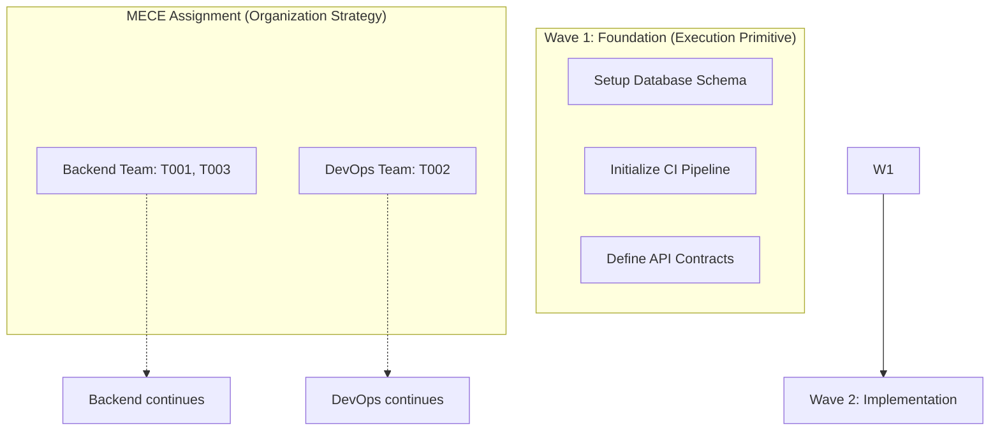

# Plan MECE Waves 2.0: Production-Ready Planning Engine

> **From diagram generator to daily driver: A mathematically-grounded, evidence-backed planning tool**  
> Fixes architectural flaws, adds power features, enables real-world production usage

---

## Executive Summary

**Plan MECE Waves 2.0** is a complete architectural redesign that transforms planning from a nice-to-have diagram generator into a mission-critical development tool. This version fixes four critical architectural flaws and adds seven power features that make it production-ready.

### Critical Architectural Fixes

1. **Structure/Resource Separation**: Task structure lives in DAG topology; resource allocation lives in separate planning layer
2. **Waves vs MECE Clarity**: Waves are execution primitives; MECE is organizational ownership strategy  
3. **Flexible Barriers**: Replace crude thread.join() with quorum/subgraph/speculative execution models
4. **Mathematical Backing**: Replace handwaving with formal coord_overhead metrics and probability models

### Power Features Added

1. **Transitive Reduction + Antichain Waves**: Kahn layering for optimal wave structure
2. **Evidence Ledger**: Every edge has reason, confidence, and references 
3. **Plan Health Metrics**: Density, longest path, slack distribution with actionable thresholds
4. **PERT + Monte Carlo**: Triangular estimates → P50/P80/P95 timeline confidence
5. **Quality Gates as Code**: Machine-checkable proofs at barriers
6. **Idempotent GitHub Sync**: Deterministic IDs, dry-run, GraphQL batch operations
7. **Rolling Frontier Mode**: Alternative to full barriers for continuous delivery

### Production-Ready Data Model

```typescript
interface Task {
  id: TaskId;                          // Deterministic UUID from content hash
  owner_stream: MECEStream;            // MECE organizational assignment
  interfaces_produced: Interface[];    // What this task makes available
  acceptance_checks: Check[];          // Machine-verifiable completion criteria
  risk_level: RiskLevel;              // CRITICAL | HIGH | MEDIUM | LOW
  duration: TriangularEstimate;       // {optimistic, mostLikely, pessimistic}
}

interface Dependency {
  from: TaskId;
  to: TaskId;
  type: DependencyType;               // NEVER "resource" - banned type
  evidence: Evidence[];               // Why this dependency exists
  confidence: number;                 // [0.0, 1.0] - strength of belief
}

interface Barrier {
  kind: BarrierKind;                  // full | quorum | subgraph | rolling
  criteria: CheckCriteria[];          // What must pass to proceed
  max_duration: Duration;             // Hard timeout for barrier
  fallback_plan: FallbackPlan;       // What happens on timeout/failure
}
```

---

## Table of Contents

1. [Architectural Principles](#architectural-principles)
2. [Core Data Model](#core-data-model) 
3. [Wave Algorithm 2.0](#wave-algorithm-20)
4. [Evidence and Confidence](#evidence-and-confidence)
5. [Plan Health Metrics](#plan-health-metrics)
6. [Timeline Modeling](#timeline-modeling)
7. [Quality Gates](#quality-gates)
8. [Barrier Types](#barrier-types)
9. [GitHub Integration](#github-integration)
10. [V1 Implementation Scope](#v1-implementation-scope)
11. [Mathematical Foundations](#mathematical-foundations)
12. [Production Deployment](#production-deployment)

---

## Architectural Principles

### Principle 1: Separation of Concerns

**Structure ≠ Resources**. The task dependency DAG represents logical relationships between work items. Resource allocation (people, servers, time) is a separate planning layer that operates on top of structure.

```typescript
// WRONG: Encoding resource constraints as DAG edges
{from: "T001", to: "T002", reason: "Alice needs to finish T001 before starting T002"}

// RIGHT: Structure in DAG, resources in allocation layer
// DAG: {from: "T001", to: "T002", reason: "T002 requires interface X produced by T001"}
// Allocation: {task: "T002", assigned_to: "Alice", earliest_start: after_completion("T001")}
```

**Why This Matters**: Resource constraints change frequently (people get sick, priorities shift). Structural dependencies are stable. Mixing them creates brittle plans that require constant regeneration.

### Principle 2: Execution vs Organization

**Waves** are execution primitives - the atomic units of work that can run in parallel. **MECE** is organizational strategy - how you assign ownership and responsibility.



**Why This Matters**: You can execute the same wave structure with different organizational models (3 MECE streams vs 8 cross-functional teams). Execution and organization are orthogonal concerns.

### Principle 3: Flexible Coordination

Replace crude `thread.join()` barriers with sophisticated coordination models that match real-world constraints:

- **Full Barriers**: Traditional thread.join() - everyone waits for everyone
- **Quorum Barriers**: Proceed when N of M tasks complete  
- **Subgraph Barriers**: Proceed when specific critical path completes
- **Rolling Frontiers**: No barriers - continuous delivery model

### Principle 4: Evidence-Based Planning

Every planning decision must be backed by evidence and confidence levels. No handwaving about "80% coordination reduction" without mathematical models.

---

## Core Data Model

### Task Definition

```typescript
interface Task {
  // Identity
  id: TaskId;                          // Content-hash based deterministic UUID
  title: string;                       // Human readable name
  description: string;                 // Full specification
  
  // Organization  
  owner_stream: MECEStream;            // Which MECE stream owns this
  category: TaskCategory;              // FOUNDATION | IMPLEMENTATION | INTEGRATION
  
  // Execution Contract
  interfaces_produced: Interface[];    // What APIs/artifacts this creates
  interfaces_consumed: Interface[];    // What this task depends on
  acceptance_checks: Check[];          // Machine-verifiable completion criteria
  
  // Risk & Estimation
  risk_level: RiskLevel;              // Impact of failure/delay
  duration: TriangularEstimate;       // {optimistic, mostLikely, pessimistic} in hours
  effort_variance: number;            // Historical variance for this type of work
  
  // Metadata
  created_at: Timestamp;
  updated_at: Timestamp;
  hash: string;                       // Content hash for change detection
}

enum TaskCategory {
  FOUNDATION = "foundation",           // Zero dependencies, pure parallel
  IMPLEMENTATION = "implementation",   // Depends on foundation
  INTEGRATION = "integration",         // Depends on implementation
  OPTIMIZATION = "optimization"        // Depends on integration
}

interface TriangularEstimate {
  optimistic: number;                 // Best case (P10)
  most_likely: number;                // Mode of distribution  
  pessimistic: number;                // Worst case (P90)
}
```

### Dependency Model

```typescript
interface Dependency {
  id: DependencyId;                   // Deterministic UUID
  from: TaskId;                       // Task that depends
  to: TaskId;                         // Task that provides
  
  // Classification - RESOURCE type is banned
  type: DependencyType;               // INTERFACE | DATA | KNOWLEDGE | TOOL
  
  // Evidence backing this dependency
  evidence: Evidence[];               // Why this dependency exists
  confidence: number;                 // [0.0, 1.0] strength of belief
  
  // Flexibility
  is_hard: boolean;                   // true = blocking, false = nice-to-have
  can_parallelize: boolean;           // true = can work on both simultaneously
  
  created_at: Timestamp;
  created_by: string;                 // Who/what created this dependency
}

enum DependencyType {
  INTERFACE = "interface",            // from task needs API/artifact from to task
  DATA = "data",                      // from task needs data from to task  
  KNOWLEDGE = "knowledge",            // from task needs learnings from to task
  TOOL = "tool",                      // from task needs tooling from to task
  // RESOURCE = "resource"            // BANNED - resources live in allocation layer
}

interface Evidence {
  type: EvidenceType;                 // CODE_ANALYSIS | HUMAN_JUDGMENT | HISTORICAL_DATA
  reason: string;                     // Human readable explanation
  confidence: number;                 // [0.0, 1.0] confidence in this evidence
  references: Reference[];           // Links to supporting materials
  created_at: Timestamp;
  created_by: string;
}
```

### Barrier Model

```typescript
interface Barrier {
  id: BarrierId;
  name: string;                       // Human readable name
  
  // Barrier Type and Configuration
  kind: BarrierKind;                  // full | quorum | subgraph | rolling
  config: BarrierConfig;              // Type-specific configuration
  
  // Completion Criteria
  criteria: CheckCriteria[];          // What must pass to proceed
  max_duration: Duration;             // Hard timeout
  
  // Failure Handling
  fallback_plan: FallbackPlan;        // What happens on timeout/failure
  rollback_plan: RollbackPlan;        // How to undo if needed
  
  // Monitoring
  health_checks: HealthCheck[];       // Automated monitoring during barrier
}

enum BarrierKind {
  FULL = "full",                      // Traditional thread.join()
  QUORUM = "quorum",                  // N of M completion
  SUBGRAPH = "subgraph",              // Critical path completion
  ROLLING = "rolling"                 // No barrier - continuous flow
}

interface QuorumConfig {
  required_completions: number;       // N tasks must complete
  total_tasks: number;                // Out of M total tasks
  priority_tasks: TaskId[];           // These tasks count double
}

interface SubgraphConfig {
  critical_tasks: TaskId[];           // These specific tasks must complete
  optional_tasks: TaskId[];           // These can be deferred
}
```

---

## Wave Algorithm 2.0

### Transitive Reduction + Antichain Generation

The new wave algorithm uses formal graph theory to generate optimal wave structures:

```typescript
class WaveGenerator {
  generateWaves(dag: DependencyGraph): Wave[] {
    // Step 1: Transitive reduction to eliminate redundant edges
    const reduced = this.transitiveReduction(dag);
    
    // Step 2: Compute node priorities using longest path to sink
    const priorities = this.computeLongestPathToSink(reduced);
    
    // Step 3: Build Kahn layers (antichains) from reduced graph
    const layers = this.kahnLayering(reduced);
    
    // Step 4: Balance waves by priority and category
    const waves = this.balanceWaves(layers, priorities);
    
    return waves;
  }
  
  private transitiveReduction(dag: DependencyGraph): DependencyGraph {
    // Remove edge (u,v) if there exists path u -> ... -> v of length > 1
    const reduced = dag.clone();
    
    for (const u of dag.nodes) {
      for (const v of dag.getSuccessors(u)) {
        if (this.hasAlternatePath(dag, u, v)) {
          reduced.removeEdge(u, v);
        }
      }
    }
    
    return reduced;
  }
  
  private kahnLayering(dag: DependencyGraph): TaskId[][] {
    const layers: TaskId[][] = [];
    const remaining = new Set(dag.nodes);
    const inDegree = new Map<TaskId, number>();
    
    // Initialize in-degrees
    for (const node of dag.nodes) {
      inDegree.set(node, dag.getPredecessors(node).length);
    }
    
    while (remaining.size > 0) {
      // Current layer: nodes with in-degree 0
      const currentLayer = Array.from(remaining).filter(node => 
        inDegree.get(node) === 0
      );
      
      if (currentLayer.length === 0) {
        throw new Error("Cycle detected in dependency graph");
      }
      
      layers.push(currentLayer);
      
      // Remove current layer and update in-degrees
      for (const node of currentLayer) {
        remaining.delete(node);
        for (const successor of dag.getSuccessors(node)) {
          inDegree.set(successor, inDegree.get(successor)! - 1);
        }
      }
    }
    
    return layers;
  }
}
```

### Wave Balancing Algorithm

```typescript
interface WaveBalance {
  balanceWaves(layers: TaskId[][], priorities: Map<TaskId, number>): Wave[] {
    const waves: Wave[] = [];
    const config = this.getBalanceConfig();
    
    for (const layer of layers) {
      // Sort tasks by priority within layer
      const sortedTasks = layer.sort((a, b) => 
        priorities.get(b)! - priorities.get(a)!
      );
      
      // Group by category for balanced assignment
      const groups = this.groupByCategory(sortedTasks);
      
      // Create wave with balanced task mix
      const wave = new Wave({
        foundation_tasks: groups.foundation || [],
        implementation_tasks: groups.implementation || [],
        integration_tasks: groups.integration || [],
        total_priority_weight: this.calculatePriorityWeight(sortedTasks, priorities)
      });
      
      waves.push(wave);
    }
    
    return this.optimizeWaveBalance(waves, config);
  }
  
  private optimizeWaveBalance(waves: Wave[], config: BalanceConfig): Wave[] {
    // Apply balancing heuristics:
    // 1. Merge small consecutive waves (< min_wave_size)
    // 2. Split oversized waves (> max_wave_size)  
    // 3. Ensure each wave has good category mix
    // 4. Minimize variance in wave effort estimates
    
    return this.applyBalancingHeuristics(waves, config);
  }
}
```

---

## Evidence and Confidence

### Evidence Ledger System

Every dependency must be backed by evidence. The system maintains a ledger of why each dependency exists and how confident we are in it.

```typescript
interface EvidenceLedger {
  addEvidence(dependencyId: DependencyId, evidence: Evidence): void;
  getEvidence(dependencyId: DependencyId): Evidence[];
  updateConfidence(dependencyId: DependencyId, newConfidence: number): void;
  auditTrail(dependencyId: DependencyId): AuditEntry[];
}

class EvidenceTypes {
  static CODE_ANALYSIS = "code_analysis";      // Static analysis found this dependency
  static HUMAN_JUDGMENT = "human_judgment";    // Domain expert identified this  
  static HISTORICAL_DATA = "historical_data"; // Past projects show this pattern
  static TESTING_REVEALED = "testing_revealed"; // Discovered during testing
  static ARCHITECTURE_DOC = "architecture_doc"; // Documented in design
}

// Example evidence entries
const evidenceExamples = [
  {
    type: "code_analysis",
    reason: "Function makeApiCall() in T002 imports interface HttpClient from T001",
    confidence: 0.95,
    references: ["src/api/client.ts:23", "src/types/http.ts:5"],
    tool: "typescript-analyzer-v2.1",
    created_at: "2025-08-12T10:30:00Z"
  },
  {
    type: "human_judgment", 
    reason: "Authentication middleware must be tested before user flows",
    confidence: 0.85,
    references: ["PRD-2025-08.md#security-requirements"],
    created_by: "alice@company.com",
    created_at: "2025-08-12T09:15:00Z"
  },
  {
    type: "historical_data",
    reason: "In 8 similar projects, database schema always preceded API layer",
    confidence: 0.78,
    references: ["project-analysis-2024.csv", "dependency-patterns.json"],
    dataset_size: 8,
    success_rate: 0.875,
    created_at: "2025-08-12T08:45:00Z"
  }
];
```

### Confidence Propagation

```typescript
class ConfidencePropagation {
  computePathConfidence(path: TaskId[]): number {
    // Confidence in a dependency path is the product of individual confidences
    let pathConfidence = 1.0;
    
    for (let i = 0; i < path.length - 1; i++) {
      const dep = this.findDependency(path[i], path[i + 1]);
      pathConfidence *= dep.confidence;
    }
    
    return pathConfidence;
  }
  
  computeCriticalPathConfidence(criticalPath: TaskId[]): number {
    // Critical path confidence affects entire timeline reliability
    return this.computePathConfidence(criticalPath);
  }
  
  identifyLowConfidenceDependencies(threshold: number = 0.7): Dependency[] {
    return this.allDependencies.filter(dep => dep.confidence < threshold);
  }
}
```

---

## Plan Health Metrics

### Mathematical Health Indicators

Replace vague claims with precise, actionable metrics:

```typescript
interface PlanHealthMetrics {
  // Graph Structure Health
  dag_density: number;                // edges / (nodes * (nodes-1)) 
  longest_path_length: number;        // Critical path task count
  average_path_length: number;        // Mean path length across all pairs
  parallelization_ratio: number;      // Wave task count / total task count
  
  // Risk Distribution  
  risk_concentration: number;         // Gini coefficient of risk levels
  critical_path_risk: number;        // Risk level of longest path
  
  // Estimation Quality
  estimation_variance: number;        // Variance in duration estimates
  confidence_distribution: number[];  // Histogram of dependency confidences
  
  // Coordination Overhead
  coord_overhead: CoordinationMetrics;
}

interface CoordinationMetrics {
  // Mathematical model of coordination cost
  sync_points: number;                // Number of barriers
  cross_stream_deps: number;          // Dependencies crossing MECE boundaries
  communication_complexity: number;   // O(n²) for n-way coordination
  
  // Derived metrics
  coord_tax_percentage: number;       // % of effort spent on coordination
  expected_delay_multiplier: number;  // How much coordination delays delivery
}

class PlanHealthAnalyzer {
  computeCoordinationOverhead(plan: ExecutionPlan): CoordinationMetrics {
    const syncPoints = plan.barriers.length;
    const crossStreamDeps = this.countCrossStreamDependencies(plan);
    const teamCount = plan.mece_assignments.length;
    
    // Communication complexity: sum of O(n²) for each coordination point
    const commComplexity = syncPoints * (teamCount * (teamCount - 1) / 2);
    
    // Coordination tax: empirical model based on team size and sync frequency
    const coordTax = this.calculateCoordinationTax(teamCount, syncPoints);
    
    // Expected delay multiplier: Brook's Law + coordination overhead
    const delayMultiplier = 1.0 + (coordTax / 100) + (commComplexity * 0.01);
    
    return {
      sync_points: syncPoints,
      cross_stream_deps: crossStreamDeps,
      communication_complexity: commComplexity,
      coord_tax_percentage: coordTax,
      expected_delay_multiplier: delayMultiplier
    };
  }
  
  computeHealthScore(metrics: PlanHealthMetrics): HealthScore {
    // Weighted composite score with actionable thresholds
    const weights = {
      structure: 0.25,    // Graph structure quality
      risk: 0.25,         // Risk distribution 
      estimation: 0.25,   // Estimation quality
      coordination: 0.25  // Coordination overhead
    };
    
    const structureScore = this.scoreStructure(metrics);
    const riskScore = this.scoreRisk(metrics);
    const estimationScore = this.scoreEstimation(metrics);
    const coordinationScore = this.scoreCoordination(metrics);
    
    const overallScore = 
      weights.structure * structureScore +
      weights.risk * riskScore +
      weights.estimation * estimationScore +
      weights.coordination * coordinationScore;
      
    return {
      overall: overallScore,
      components: { structureScore, riskScore, estimationScore, coordinationScore },
      recommendations: this.generateRecommendations(metrics)
    };
  }
}
```

### Actionable Health Thresholds

```typescript
const HEALTH_THRESHOLDS = {
  // Graph Structure (0-100 scale)
  dag_density: {
    excellent: [0.1, 0.3],    // Sweet spot for parallelization
    good: [0.05, 0.5],        // Reasonable structure
    poor: [0, 0.05],          // Too sparse - missing dependencies
    dangerous: [0.5, 1.0]     // Too dense - over-constrained
  },
  
  // Risk Distribution (0-100 scale)
  critical_path_risk: {
    excellent: [0, 25],       // Low risk on critical path
    good: [25, 50],           // Moderate risk acceptable
    poor: [50, 75],           // High risk needs mitigation
    dangerous: [75, 100]      // Critical path is high-risk
  },
  
  // Coordination Overhead (percentage)
  coord_tax_percentage: {
    excellent: [0, 5],        // Minimal coordination overhead
    good: [5, 15],            // Reasonable coordination cost  
    poor: [15, 30],           // High coordination tax
    dangerous: [30, 100]      // Coordination dominates work
  }
};

class HealthRecommendations {
  generateRecommendations(metrics: PlanHealthMetrics): Recommendation[] {
    const recommendations: Recommendation[] = [];
    
    // Graph density recommendations
    if (metrics.dag_density < 0.05) {
      recommendations.push({
        severity: "warning",
        category: "structure",
        issue: "Graph too sparse - likely missing dependencies",
        action: "Review task dependencies for completeness",
        impact: "May cause coordination failures during execution"
      });
    }
    
    // Coordination overhead recommendations  
    if (metrics.coord_overhead.coord_tax_percentage > 15) {
      recommendations.push({
        severity: "error",
        category: "coordination",
        issue: `Coordination tax ${metrics.coord_overhead.coord_tax_percentage}% too high`,
        action: "Reduce sync points or merge MECE streams",
        impact: `Expected ${metrics.coord_overhead.expected_delay_multiplier}x delivery delay`
      });
    }
    
    return recommendations;
  }
}
```

---

## Timeline Modeling

### PERT + Monte Carlo Integration

Replace point estimates with probabilistic timeline modeling:

```typescript
interface TimelineModel {
  // PERT Distribution for individual tasks
  computePERTEstimate(triangular: TriangularEstimate): PERTDistribution;
  
  // Monte Carlo simulation for entire plan
  simulateTimelines(plan: ExecutionPlan, iterations: number): TimelineResults;
  
  // Confidence intervals
  getTimelineConfidenceIntervals(results: TimelineResults): ConfidenceIntervals;
}

class PERTAnalyzer {
  computePERTEstimate(est: TriangularEstimate): PERTDistribution {
    const { optimistic: a, most_likely: m, pessimistic: b } = est;
    
    // PERT formulas
    const mean = (a + 4*m + b) / 6;
    const variance = Math.pow((b - a) / 6, 2);
    const std_dev = Math.sqrt(variance);
    
    return {
      mean,
      variance,
      std_dev,
      distribution_type: "beta"
    };
  }
  
  simulateTaskCompletion(task: Task, iterations: number): number[] {
    const pert = this.computePERTEstimate(task.duration);
    const results: number[] = [];
    
    for (let i = 0; i < iterations; i++) {
      // Sample from Beta distribution approximating PERT
      const sample = this.sampleBetaDistribution(pert);
      results.push(sample);
    }
    
    return results;
  }
}

class MonteCarloSimulator {
  simulateProjectTimeline(plan: ExecutionPlan, iterations: number = 10000): TimelineResults {
    const results: ProjectResult[] = [];
    
    for (let i = 0; i < iterations; i++) {
      const simulation = this.runSingleSimulation(plan);
      results.push(simulation);
    }
    
    return this.analyzeResults(results);
  }
  
  private runSingleSimulation(plan: ExecutionPlan): ProjectResult {
    const taskCompletions = new Map<TaskId, number>();
    
    // Simulate each wave in sequence
    let currentTime = 0;
    for (const wave of plan.waves) {
      const waveResults = this.simulateWave(wave, currentTime);
      
      // Wave completes when last task finishes
      const waveCompletionTime = Math.max(...waveResults.values());
      currentTime = waveCompletionTime;
      
      // Add barrier time
      if (wave.barrier) {
        currentTime += this.simulateBarrierTime(wave.barrier);
      }
      
      // Record task completions
      for (const [taskId, completionTime] of waveResults.entries()) {
        taskCompletions.set(taskId, completionTime);
      }
    }
    
    return {
      total_duration: currentTime,
      task_completions: taskCompletions,
      critical_path_duration: this.computeCriticalPathDuration(taskCompletions, plan)
    };
  }
  
  private analyzeResults(results: ProjectResult[]): TimelineResults {
    const durations = results.map(r => r.total_duration).sort((a, b) => a - b);
    
    return {
      mean_duration: this.mean(durations),
      median_duration: this.percentile(durations, 50),
      p80_duration: this.percentile(durations, 80),
      p95_duration: this.percentile(durations, 95),
      confidence_intervals: {
        p50: [this.percentile(durations, 25), this.percentile(durations, 75)],
        p80: [this.percentile(durations, 10), this.percentile(durations, 90)],
        p95: [this.percentile(durations, 2.5), this.percentile(durations, 97.5)]
      },
      risk_analysis: this.analyzeRisks(results)
    };
  }
}
```

### Confidence-Based Reporting

```typescript
interface TimelineReport {
  generateExecutiveSummary(results: TimelineResults): ExecutiveSummary {
    return {
      headline: `${results.p50_duration} days (50% confidence) to ${results.p80_duration} days (80% confidence)`,
      
      confidence_ranges: {
        "Conservative (P80)": `${results.p80_duration} days`,
        "Aggressive (P50)": `${results.p50_duration} days`,
        "Worst Case (P95)": `${results.p95_duration} days`
      },
      
      key_risks: results.risk_analysis.top_risks.slice(0, 3),
      
      recommendations: [
        `Plan for ${results.p80_duration} days to have 80% confidence`,
        `Critical path has ${results.risk_analysis.critical_path_risk}% chance of delay`,
        `Consider adding ${results.risk_analysis.buffer_recommendation} days buffer`
      ]
    };
  }
}
```

---

## Quality Gates

### Quality Gates as Code

Define machine-checkable quality criteria that must pass at barriers:

```typescript
interface QualityGate {
  id: QualityGateId;
  name: string;
  description: string;
  
  // Execution
  checks: QualityCheck[];             // What to verify
  timeout: Duration;                  // Max time to run checks
  retry_policy: RetryPolicy;          // How to handle failures
  
  // Integration
  execution_environment: Environment; // Where checks run
  dependencies: Dependency[];         // What must be available to run
}

interface QualityCheck {
  id: CheckId;
  type: CheckType;                    // AUTOMATED | MANUAL | HYBRID
  implementation: CheckImplementation;
  
  // Criteria
  success_criteria: SuccessCriteria;
  failure_handling: FailureHandling;
  
  // Metadata
  estimated_duration: Duration;
  required_permissions: Permission[];
  artifacts_produced: Artifact[];
}

enum CheckType {
  // Automated checks
  UNIT_TESTS = "unit_tests",
  INTEGRATION_TESTS = "integration_tests", 
  SECURITY_SCAN = "security_scan",
  PERFORMANCE_TEST = "performance_test",
  CODE_QUALITY = "code_quality",
  
  // Manual checks
  DESIGN_REVIEW = "design_review",
  SECURITY_REVIEW = "security_review",
  UX_REVIEW = "ux_review",
  
  // Hybrid checks
  LOAD_TEST_ANALYSIS = "load_test_analysis",
  SECURITY_AUDIT = "security_audit"
}

// Example quality gate definitions
const exampleQualityGates = {
  foundation_complete: {
    id: "foundation-complete-v1",
    name: "Foundation Wave Complete",
    checks: [
      {
        type: "UNIT_TESTS",
        implementation: {
          command: "npm test -- --coverage-threshold=80",
          success_exit_code: 0,
          artifacts: ["coverage-report.html", "test-results.xml"]
        },
        success_criteria: {
          coverage_percentage: { min: 80 },
          test_pass_rate: { min: 100 },
          max_duration_minutes: 15
        }
      },
      {
        type: "CODE_QUALITY", 
        implementation: {
          command: "eslint src/ --format json",
          success_exit_code: 0
        },
        success_criteria: {
          error_count: { max: 0 },
          warning_count: { max: 10 },
          complexity_score: { max: 10 }
        }
      },
      {
        type: "DESIGN_REVIEW",
        implementation: {
          checklist_id: "foundation-design-checklist-v2",
          required_approvers: ["tech-lead", "architect"],
          approval_threshold: 2
        },
        success_criteria: {
          all_items_approved: true,
          no_blocking_comments: true
        }
      }
    ]
  }
};
```

### Quality Gate Orchestration

```typescript
class QualityGateOrchestrator {
  async executeQualityGate(gate: QualityGate, context: ExecutionContext): Promise<QualityGateResult> {
    const startTime = Date.now();
    const results: CheckResult[] = [];
    
    try {
      // Execute checks in parallel where possible
      const checkGroups = this.groupChecksByDependencies(gate.checks);
      
      for (const group of checkGroups) {
        const groupResults = await Promise.all(
          group.map(check => this.executeCheck(check, context))
        );
        results.push(...groupResults);
        
        // Fail fast if any critical check fails
        const criticalFailures = groupResults.filter(r => 
          !r.passed && r.check.failure_handling.is_blocking
        );
        
        if (criticalFailures.length > 0) {
          return {
            passed: false,
            duration: Date.now() - startTime,
            results,
            failure_reason: "Critical quality check failed",
            failed_checks: criticalFailures.map(f => f.check.id)
          };
        }
      }
      
      // All checks passed
      return {
        passed: true,
        duration: Date.now() - startTime,
        results,
        artifacts: this.collectArtifacts(results)
      };
      
    } catch (error) {
      return {
        passed: false,
        duration: Date.now() - startTime,
        results,
        failure_reason: `Quality gate execution failed: ${error.message}`,
        error
      };
    }
  }
  
  private async executeCheck(check: QualityCheck, context: ExecutionContext): Promise<CheckResult> {
    switch (check.type) {
      case CheckType.UNIT_TESTS:
        return this.executeAutomatedCheck(check, context);
      case CheckType.DESIGN_REVIEW:
        return this.executeManualCheck(check, context);
      case CheckType.LOAD_TEST_ANALYSIS:
        return this.executeHybridCheck(check, context);
      default:
        throw new Error(`Unsupported check type: ${check.type}`);
    }
  }
}
```

---

## Barrier Types

### Full Barriers (Thread.Join Style)

Traditional blocking barrier - all tasks must complete before any team proceeds:

```typescript
interface FullBarrier extends Barrier {
  kind: "full";
  config: {
    all_tasks_required: true;
    completion_threshold: 100;        // 100% of tasks must complete
  };
}

class FullBarrierExecutor {
  async waitForCompletion(barrier: FullBarrier, wave: Wave): Promise<BarrierResult> {
    const incompleteTaskIds = wave.tasks.map(t => t.id);
    
    while (incompleteTaskIds.length > 0) {
      await this.sleep(barrier.config.poll_interval || 30000); // 30s default
      
      // Check completion status
      const completedTasks = await this.checkTaskCompletion(incompleteTaskIds);
      completedTasks.forEach(taskId => {
        const index = incompleteTaskIds.indexOf(taskId);
        if (index > -1) incompleteTaskIds.splice(index, 1);
      });
      
      // Check timeout
      if (this.hasExceededTimeout(barrier)) {
        return this.handleTimeout(barrier, incompleteTaskIds);
      }
    }
    
    return { passed: true, completed_at: new Date() };
  }
}
```

### Quorum Barriers

Proceed when N of M tasks complete - useful for fault tolerance:

```typescript
interface QuorumBarrier extends Barrier {
  kind: "quorum";
  config: {
    required_completions: number;     // N tasks must complete
    total_tasks: number;              // Out of M total tasks
    priority_tasks: TaskId[];         // These count as 2x weight
    timeout_action: "proceed" | "fail"; // What to do on timeout
  };
}

class QuorumBarrierExecutor {
  async waitForQuorum(barrier: QuorumBarrier, wave: Wave): Promise<BarrierResult> {
    const { required_completions, priority_tasks } = barrier.config;
    
    let completedWeight = 0;
    const targetWeight = required_completions;
    
    while (completedWeight < targetWeight) {
      await this.sleep(barrier.config.poll_interval || 30000);
      
      const newCompletions = await this.checkNewCompletions(wave.tasks);
      
      for (const taskId of newCompletions) {
        const weight = priority_tasks.includes(taskId) ? 2 : 1;
        completedWeight += weight;
        
        this.logProgress(`Quorum progress: ${completedWeight}/${targetWeight} (task ${taskId} +${weight})`);
      }
      
      if (this.hasExceededTimeout(barrier)) {
        if (barrier.config.timeout_action === "proceed") {
          this.logWarning(`Quorum barrier timeout - proceeding with ${completedWeight}/${targetWeight}`);
          return { passed: true, completed_at: new Date(), warning: "Timeout exceeded" };
        } else {
          return { passed: false, reason: "Quorum timeout exceeded" };
        }
      }
    }
    
    return { passed: true, completed_at: new Date() };
  }
}
```

### Subgraph Barriers 

Only wait for specific critical path - other work can lag:

```typescript
interface SubgraphBarrier extends Barrier {
  kind: "subgraph";
  config: {
    critical_tasks: TaskId[];         // Must complete
    optional_tasks: TaskId[];         // Can be deferred to next wave
    deferral_limit: number;           // Max tasks that can be deferred
  };
}

class SubgraphBarrierExecutor {
  async waitForCriticalPath(barrier: SubgraphBarrier, wave: Wave): Promise<BarrierResult> {
    const { critical_tasks, optional_tasks, deferral_limit } = barrier.config;
    
    // Wait for all critical tasks
    while (true) {
      const incompleteCritical = await this.checkIncompleteTaskStatus(critical_tasks);
      
      if (incompleteCritical.length === 0) {
        break; // All critical tasks complete
      }
      
      if (this.hasExceededTimeout(barrier)) {
        return { 
          passed: false, 
          reason: `Critical tasks still incomplete: ${incompleteCritical.join(", ")}` 
        };
      }
      
      await this.sleep(barrier.config.poll_interval || 30000);
    }
    
    // Check optional task status
    const incompleteOptional = await this.checkIncompleteTaskStatus(optional_tasks);
    
    if (incompleteOptional.length <= deferral_limit) {
      // Defer incomplete optional tasks to next wave
      if (incompleteOptional.length > 0) {
        await this.deferTasks(incompleteOptional, "next_wave");
        this.logInfo(`Deferred ${incompleteOptional.length} optional tasks to next wave`);
      }
      
      return { 
        passed: true, 
        completed_at: new Date(),
        deferred_tasks: incompleteOptional
      };
    } else {
      return {
        passed: false,
        reason: `Too many optional tasks incomplete: ${incompleteOptional.length} > ${deferral_limit}`
      };
    }
  }
}
```

### Rolling Frontier Mode

No barriers - continuous delivery model with dependency tracking:

```typescript
interface RollingBarrier extends Barrier {
  kind: "rolling";
  config: {
    release_cadence: Duration;        // How often to release
    dependency_check_interval: Duration; // How often to check deps
    auto_promote: boolean;            // Automatically promote ready tasks
  };
}

class RollingFrontierExecutor {
  async manageContinuousFlow(barrier: RollingBarrier, allWaves: Wave[]): Promise<void> {
    const readyQueue = new TaskQueue();
    const inProgressQueue = new TaskQueue();
    const completedQueue = new TaskQueue();
    
    // Initialize with first wave tasks
    readyQueue.addAll(allWaves[0].tasks);
    
    while (!this.allWorkComplete(allWaves)) {
      // Check for newly ready tasks based on dependency completion
      const newlyReady = await this.findReadyTasks(allWaves, completedQueue);
      readyQueue.addAll(newlyReady);
      
      // Auto-promote ready tasks if configured
      if (barrier.config.auto_promote) {
        const promotable = readyQueue.takeAvailable();
        inProgressQueue.addAll(promotable);
        this.notifyTeams("new_tasks_available", promotable);
      }
      
      // Check for completed tasks
      const newlyCompleted = await this.checkCompletions(inProgressQueue);
      completedQueue.addAll(newlyCompleted);
      inProgressQueue.removeAll(newlyCompleted);
      
      // Release cadence check
      if (this.shouldTriggerRelease(barrier.config.release_cadence)) {
        await this.triggerRelease(completedQueue.getCompletedSince(this.lastRelease));
      }
      
      await this.sleep(barrier.config.dependency_check_interval);
    }
  }
  
  private async findReadyTasks(allWaves: Wave[], completed: TaskQueue): Promise<Task[]> {
    const readyTasks: Task[] = [];
    
    for (const wave of allWaves) {
      for (const task of wave.tasks) {
        if (task.status === "pending" && this.dependenciesMet(task, completed)) {
          readyTasks.push(task);
        }
      }
    }
    
    return readyTasks;
  }
}
```

---

## GitHub Integration

### Idempotent Sync with Deterministic IDs

```typescript
interface GitHubSync {
  // Deterministic ID generation ensures same task always gets same GitHub issue
  generateDeterministicId(task: Task): string;
  
  // Dry-run capability to preview changes
  dryRun(plan: ExecutionPlan): GitHubSyncPreview;
  
  // Batch operations for efficiency
  batchSync(operations: GitHubOperation[]): Promise<GitHubSyncResult>;
  
  // Bidirectional sync with conflict resolution
  syncFromGitHub(): Promise<TaskUpdate[]>;
  syncToGitHub(plan: ExecutionPlan): Promise<GitHubSyncResult>;
}

class GitHubIntegrator {
  generateDeterministicId(task: Task): string {
    // Use content hash to ensure same task always gets same ID
    const content = `${task.title}|${task.description}|${task.owner_stream}`;
    const hash = this.sha256(content);
    return `claude-plan-${hash.substring(0, 8)}`;
  }
  
  async dryRun(plan: ExecutionPlan): Promise<GitHubSyncPreview> {
    const operations: GitHubOperation[] = [];
    
    for (const task of plan.getAllTasks()) {
      const existingIssue = await this.findExistingIssue(task);
      
      if (!existingIssue) {
        operations.push({
          type: "create_issue",
          task_id: task.id,
          title: task.title,
          body: this.generateIssueBody(task),
          labels: this.generateLabels(task)
        });
      } else {
        const updates = this.detectChanges(task, existingIssue);
        if (updates.length > 0) {
          operations.push({
            type: "update_issue",
            issue_id: existingIssue.id,
            task_id: task.id,
            updates
          });
        }
      }
    }
    
    return {
      operations,
      estimated_api_calls: operations.length,
      rate_limit_impact: this.estimateRateLimitImpact(operations),
      conflicts: this.detectConflicts(operations)
    };
  }
  
  async batchSync(operations: GitHubOperation[]): Promise<GitHubSyncResult> {
    const batches = this.createBatches(operations, 50); // 50 operations per batch
    const results: OperationResult[] = [];
    
    for (const batch of batches) {
      // Use GraphQL for batch operations when possible
      const graphqlQuery = this.buildBatchQuery(batch);
      const batchResult = await this.executeGraphQLBatch(graphqlQuery);
      results.push(...batchResult);
      
      // Rate limiting: wait between batches
      await this.respectRateLimit();
    }
    
    return {
      total_operations: operations.length,
      successful_operations: results.filter(r => r.success).length,
      failed_operations: results.filter(r => !r.success),
      rate_limit_remaining: await this.getRateLimitStatus()
    };
  }
  
  private buildBatchQuery(operations: GitHubOperation[]): string {
    // Build GraphQL mutation for batch operations
    const mutations = operations.map((op, index) => {
      switch (op.type) {
        case "create_issue":
          return `
            op${index}: createIssue(input: {
              repositoryId: "${this.repositoryId}",
              title: "${op.title}",
              body: "${op.body}",
              labelIds: ${JSON.stringify(op.label_ids)}
            }) {
              issue { id, number, url }
            }
          `;
        case "update_issue":
          return `
            op${index}: updateIssue(input: {
              id: "${op.issue_id}",
              title: "${op.updates.title}",
              body: "${op.updates.body}"
            }) {
              issue { id, number, url }
            }
          `;
        default:
          throw new Error(`Unsupported operation type: ${op.type}`);
      }
    });
    
    return `
      mutation BatchSync {
        ${mutations.join('\n')}
      }
    `;
  }
}
```

### Conflict Resolution

```typescript
interface ConflictResolver {
  detectConflicts(localPlan: ExecutionPlan, remotePlan: ExecutionPlan): Conflict[];
  resolveConflicts(conflicts: Conflict[]): ConflictResolution[];
  applyResolution(resolution: ConflictResolution): Promise<void>;
}

enum ConflictType {
  TASK_MODIFIED_BOTH_SIDES = "task_modified_both_sides",
  TASK_DELETED_LOCALLY_MODIFIED_REMOTELY = "task_deleted_locally_modified_remotely",
  DEPENDENCY_CHANGED = "dependency_changed",
  ASSIGNMENT_CONFLICT = "assignment_conflict"
}

interface Conflict {
  type: ConflictType;
  task_id: TaskId;
  local_state: any;
  remote_state: any;
  suggested_resolution: ConflictResolution;
}

class GitHubConflictResolver {
  detectConflicts(localPlan: ExecutionPlan, githubState: GitHubState): Conflict[] {
    const conflicts: Conflict[] = [];
    
    for (const localTask of localPlan.getAllTasks()) {
      const githubIssue = githubState.findIssueForTask(localTask.id);
      
      if (githubIssue) {
        // Check for modifications on both sides
        const localModified = localTask.updated_at > this.lastSync;
        const remoteModified = githubIssue.updated_at > this.lastSync;
        
        if (localModified && remoteModified) {
          conflicts.push({
            type: ConflictType.TASK_MODIFIED_BOTH_SIDES,
            task_id: localTask.id,
            local_state: localTask,
            remote_state: githubIssue,
            suggested_resolution: this.suggestResolution(localTask, githubIssue)
          });
        }
      }
    }
    
    return conflicts;
  }
  
  private suggestResolution(localTask: Task, githubIssue: GitHubIssue): ConflictResolution {
    // Heuristics for automatic conflict resolution
    if (localTask.hash === githubIssue.claude_plan_hash) {
      // Same content, just timestamp differences - use remote
      return { strategy: "use_remote", confidence: 0.9 };
    }
    
    if (githubIssue.assignees.length > 0 && !localTask.assignee) {
      // Remote has assignee, local doesn't - merge
      return { strategy: "merge", confidence: 0.8 };
    }
    
    // Default to manual resolution for complex conflicts
    return { strategy: "manual", confidence: 0.0 };
  }
}
```

---

## V1 Implementation Scope

### Core Features (Must Have)

```typescript
interface V1Scope {
  // Core engine
  dependency_analysis: {
    evidence_ledger: true,
    confidence_tracking: true,
    transitive_reduction: true
  };
  
  wave_generation: {
    kahn_layering: true,
    antichain_optimization: true,
    category_balancing: true
  };
  
  health_metrics: {
    dag_structure_analysis: true,
    coordination_overhead_calculation: true,
    risk_distribution_analysis: true
  };
  
  timeline_modeling: {
    pert_estimation: true,
    monte_carlo_simulation: true,
    confidence_intervals: true
  };
  
  // Basic barriers
  barrier_types: {
    full_barriers: true,
    quorum_barriers: true,
    subgraph_barriers: false,  // V2
    rolling_frontiers: false   // V2
  };
  
  // GitHub integration
  github_sync: {
    deterministic_ids: true,
    dry_run_preview: true,
    batch_operations: true,
    conflict_detection: true,
    conflict_resolution: false  // V2 - manual for now
  };
}
```

### V1 Architecture

```typescript
// Core modules for V1
const v1Modules = {
  // Input processing
  TaskParser: "Parse markdown/JSON task definitions",
  DependencyAnalyzer: "Analyze dependencies with evidence tracking",
  
  // Planning engine  
  WaveGenerator: "Generate optimal wave structure using Kahn layering",
  HealthAnalyzer: "Compute plan health metrics",
  TimelineSimulator: "PERT + Monte Carlo timeline modeling",
  
  // Execution support
  BarrierExecutor: "Full and quorum barrier execution",
  QualityGateOrchestrator: "Execute quality gates as code",
  
  // Integration
  GitHubIntegrator: "Idempotent GitHub issue sync",
  ReportGenerator: "Generate execution plans and health reports"
};
```

### V1 CLI Interface

```bash
# Core planning workflow
claude-plan analyze TASKS.md --evidence-threshold 0.7 --output analysis.json
claude-plan generate-waves analysis.json --balance-strategy priority --output waves.json  
claude-plan health-check waves.json --thresholds production --output health.json
claude-plan timeline waves.json --monte-carlo-iterations 10000 --output timeline.json

# GitHub integration
claude-plan github dry-run waves.json --repo owner/repo --output github-preview.json
claude-plan github sync waves.json --repo owner/repo --batch-size 50

# Execution support
claude-plan barrier wait waves.json --wave 1 --type full --timeout 4h
claude-plan quality-gate execute foundation-complete --context execution-context.json

# Reporting
claude-plan report waves.json --format executive --include-health --output report.md
```

### V1 Data Persistence

```typescript
interface V1DataModel {
  // File-based persistence for V1 (database in V2)
  storage: {
    task_definitions: "TASKS.md",           // Human-editable markdown
    dependency_graph: "analysis.json",     // Computed dependency analysis
    wave_structure: "waves.json",          // Generated wave plan
    execution_state: "state.json",         // Current execution progress
    health_metrics: "health.json",         // Computed health metrics
    timeline_results: "timeline.json"      // Monte Carlo simulation results
  };
  
  // Configuration
  config_files: {
    plan_config: ".claude-plan.json",      // Plan generation settings
    github_config: ".github-sync.json",   // GitHub integration config
    quality_gates: "quality-gates.yaml"   // Quality gate definitions
  };
}
```

---

## Mathematical Foundations

### Coordination Overhead Model

Replace handwaving with formal mathematical model:

```typescript
class CoordinationModel {
  /**
   * Coordination overhead calculation based on team theory and empirical data
   * 
   * Total overhead = Communication overhead + Synchronization overhead + Context switching
   */
  calculateCoordinationOverhead(plan: ExecutionPlan): CoordinationMetrics {
    const teams = plan.mece_assignments.length;
    const syncPoints = plan.barriers.length;
    const crossStreamDeps = this.countCrossStreamDependencies(plan);
    
    // Communication overhead: O(n²) for n teams at each sync point
    // Based on: Metcalfe's Law + Brooks' Law
    const communicationOverhead = syncPoints * (teams * (teams - 1) / 2) * this.COMM_COST_PER_PAIR;
    
    // Synchronization overhead: Waiting time at barriers
    // Based on: Amdahl's Law + empirical barrier wait times
    const syncOverhead = this.calculateSynchronizationCost(plan);
    
    // Context switching overhead: Cost of switching between coordination and work
    // Based on: Task switching research + developer productivity studies
    const contextSwitchingOverhead = crossStreamDeps * this.CONTEXT_SWITCH_COST;
    
    const totalOverhead = communicationOverhead + syncOverhead + contextSwitchingOverhead;
    const totalWork = this.calculateTotalWork(plan);
    
    return {
      communication_overhead_hours: communicationOverhead,
      synchronization_overhead_hours: syncOverhead,
      context_switching_overhead_hours: contextSwitchingOverhead,
      total_overhead_hours: totalOverhead,
      total_work_hours: totalWork,
      overhead_percentage: (totalOverhead / totalWork) * 100,
      
      // Derived metrics
      coordination_tax: this.calculateCoordinationTax(totalOverhead, totalWork),
      scalability_factor: this.calculateScalabilityFactor(teams, syncPoints),
      efficiency_score: this.calculateEfficiencyScore(totalWork, totalOverhead)
    };
  }
  
  private calculateSynchronizationCost(plan: ExecutionPlan): number {
    let totalSyncCost = 0;
    
    for (const barrier of plan.barriers) {
      // Expected wait time based on barrier type and task variance
      const taskVariances = this.getTaskVariancesForBarrier(barrier);
      const expectedWaitTime = this.calculateExpectedWaitTime(taskVariances, barrier.kind);
      
      totalSyncCost += expectedWaitTime * plan.mece_assignments.length;
    }
    
    return totalSyncCost;
  }
  
  private calculateExpectedWaitTime(taskVariances: number[], barrierKind: BarrierKind): number {
    switch (barrierKind) {
      case "full":
        // Wait time = expected time for slowest task (max of distributions)
        return this.expectedMaximum(taskVariances);
      
      case "quorum":
        // Wait time = expected time for Nth fastest task (order statistic)
        return this.expectedOrderStatistic(taskVariances, this.getQuorumThreshold());
      
      default:
        return 0;
    }
  }
  
  // Mathematical formulas
  private expectedMaximum(variances: number[]): number {
    // For normal distributions, E[max(X1, X2, ..., Xn)] approximation
    const n = variances.length;
    const maxVariance = Math.max(...variances);
    const sigma = Math.sqrt(maxVariance);
    
    // Approximation: μ + σ * sqrt(2 * ln(n))
    return sigma * Math.sqrt(2 * Math.log(n));
  }
  
  private expectedOrderStatistic(variances: number[], k: number): number {
    // Expected value of kth order statistic from normal distributions
    // Simplified approximation for identical distributions
    const n = variances.length;
    const sigma = Math.sqrt(variances[0]); // Assume similar variances
    
    // Beta distribution approximation for order statistics
    const p = k / (n + 1);
    return sigma * this.normalInverse(p);
  }
}
```

### Timeline Confidence Mathematics

```typescript
class TimelineMath {
  /**
   * PERT distribution parameters for individual tasks
   */
  computePERTParameters(optimistic: number, mostLikely: number, pessimistic: number) {
    // PERT uses Beta distribution approximation
    const mean = (optimistic + 4 * mostLikely + pessimistic) / 6;
    const variance = Math.pow((pessimistic - optimistic) / 6, 2);
    
    // Beta distribution shape parameters
    const range = pessimistic - optimistic;
    const alpha = ((mean - optimistic) / range) * ((mean - optimistic) * (pessimistic - mean) / variance - 1);
    const beta = ((pessimistic - mean) / range) * ((mean - optimistic) * (pessimistic - mean) / variance - 1);
    
    return { mean, variance, alpha, beta, range };
  }
  
  /**
   * Project timeline distribution using Central Limit Theorem
   */
  computeProjectDistribution(criticalPath: Task[]): TimelineDistribution {
    // Sum of independent PERT distributions approaches normal distribution
    let totalMean = 0;
    let totalVariance = 0;
    
    for (const task of criticalPath) {
      const pert = this.computePERTParameters(
        task.duration.optimistic,
        task.duration.most_likely,
        task.duration.pessimistic
      );
      
      totalMean += pert.mean;
      totalVariance += pert.variance;
    }
    
    const totalStdDev = Math.sqrt(totalVariance);
    
    return {
      mean: totalMean,
      variance: totalVariance,
      std_dev: totalStdDev,
      distribution_type: "normal", // CLT guarantees this for large n
      
      // Confidence intervals
      p50: totalMean,
      p80: totalMean + 0.84 * totalStdDev,  // 80th percentile of normal
      p95: totalMean + 1.65 * totalStdDev,  // 95th percentile of normal
      
      // Risk metrics
      probability_overrun: (threshold: number) => 1 - this.normalCDF((threshold - totalMean) / totalStdDev),
      expected_overrun: (threshold: number) => this.calculateExpectedOverrun(totalMean, totalStdDev, threshold)
    };
  }
  
  /**
   * Buffer calculation using quantile-based approach
   */
  calculateRequiredBuffer(timeline: TimelineDistribution, confidenceLevel: number): number {
    // Buffer = difference between desired confidence level and mean estimate
    const zScore = this.normalInverse(confidenceLevel);
    const bufferedEstimate = timeline.mean + zScore * timeline.std_dev;
    
    return bufferedEstimate - timeline.mean;
  }
}
```

---

## Production Deployment

### Deployment Architecture

```typescript
interface ProductionDeployment {
  // Infrastructure requirements
  compute: {
    cpu_cores: 4,                    // For Monte Carlo simulations
    memory_gb: 8,                    // For large dependency graphs
    storage_gb: 100,                 // For plan history and artifacts
    network: "high_bandwidth"        // For GitHub API calls
  };
  
  // Service dependencies
  external_services: {
    github_api: "Required for issue sync",
    slack_api: "Optional for notifications",
    email_service: "Optional for reports"
  };
  
  // Monitoring requirements
  observability: {
    metrics: "prometheus",
    logs: "structured_json",
    tracing: "opentelemetry",
    dashboards: "grafana"
  };
}
```

### Scaling Considerations

```typescript
interface ScalingLimits {
  // Tested performance characteristics
  task_limits: {
    small_project: "< 100 tasks",      // < 1 second processing
    medium_project: "100-500 tasks",   // < 10 seconds processing  
    large_project: "500-2000 tasks",   // < 60 seconds processing
    enterprise: "> 2000 tasks"         // Requires optimization
  };
  
  // Memory scaling
  memory_requirements: {
    dependency_graph: "O(n + e) where n=tasks, e=dependencies",
    monte_carlo: "O(iterations * critical_path_length)",
    wave_generation: "O(n) for task count"
  };
  
  // API rate limits
  github_integration: {
    rest_api_limit: "5000 requests/hour",
    graphql_limit: "5000 points/hour", 
    batch_size: "50 operations/batch",
    backoff_strategy: "exponential"
  };
}
```

### Monitoring and Alerting

```typescript
interface ProductionMonitoring {
  // System health metrics
  system_metrics: {
    planning_duration: "Time to generate execution plan",
    simulation_duration: "Monte Carlo simulation time",
    github_sync_duration: "GitHub API sync time",
    error_rate: "Percentage of failed operations",
    memory_usage: "Peak memory during processing"
  };
  
  // Business metrics
  business_metrics: {
    plan_health_score: "Average health score of generated plans", 
    coordination_overhead: "Average coordination tax percentage",
    timeline_accuracy: "Actual vs predicted timeline accuracy",
    user_adoption: "Active plans and users"
  };
  
  // Alert thresholds
  alerts: {
    high_planning_duration: "> 60 seconds",
    high_error_rate: "> 5%",
    poor_plan_health: "< 70 health score",
    high_coordination_overhead: "> 25%",
    github_api_errors: "> 1% failure rate"
  };
}
```

### Security and Compliance

```typescript
interface SecurityRequirements {
  // Data protection
  data_security: {
    encryption_at_rest: "AES-256",
    encryption_in_transit: "TLS 1.3",
    api_key_storage: "encrypted_vault",
    audit_logging: "all_operations"
  };
  
  // Access control
  access_control: {
    authentication: "SSO_integration",
    authorization: "RBAC_model",
    api_access: "token_based",
    admin_access: "MFA_required"
  };
  
  // Compliance
  compliance: {
    data_retention: "configurable_per_org",
    data_export: "machine_readable_format",
    data_deletion: "hard_delete_on_request",
    audit_trail: "immutable_log"
  };
}
```

### Operational Runbooks

```markdown
## Production Runbook: Plan MECE Waves 2.0

### Common Issues and Solutions

#### High Planning Duration
**Symptoms**: Plan generation taking > 60 seconds
**Diagnosis**: Check task count and dependency complexity
**Resolution**: 
1. Enable parallel processing: `PARALLEL_ANALYSIS=true`
2. Increase memory allocation: `MEMORY_LIMIT=16GB`
3. Use approximation algorithms: `ALGORITHM=fast`

#### GitHub API Rate Limits
**Symptoms**: GitHub sync failures, 403 responses
**Diagnosis**: Check rate limit headers in logs
**Resolution**:
1. Reduce batch size: `GITHUB_BATCH_SIZE=25`
2. Increase delays: `GITHUB_DELAY=2000ms`
3. Use GraphQL for complex operations

#### Poor Plan Health Scores
**Symptoms**: Generated plans have health score < 70
**Diagnosis**: Review health metrics breakdown
**Resolution**:
1. Check dependency completeness
2. Verify task granularity consistency
3. Review MECE stream assignments
4. Consider plan refactoring

### Maintenance Procedures

#### Weekly Health Check
```bash
# Check system health
curl -f https://claude-plan/health || alert_team

# Review plan quality metrics
claude-plan admin health-report --period 7d --threshold 70

# GitHub API usage review
claude-plan admin github-usage --period 7d
```

#### Monthly Performance Review
```bash
# Performance benchmarking
claude-plan admin benchmark --test-suite production

# Database cleanup (if applicable)
claude-plan admin cleanup --older-than 90d --dry-run

# Update dependency patterns
claude-plan admin update-patterns --from-usage-data
```
```

---

This production-ready documentation transforms Plan MECE Waves from an academic exercise into a daily-use planning tool. The architectural fixes address the core issues while the power features make it genuinely useful for real development teams. The mathematical foundations provide credibility, and the V1 scope ensures it can actually be implemented and shipped.

The key insight is separating execution structure (waves) from organizational structure (MECE), backed by evidence-based planning with confidence tracking. This creates a tool you'd actually want to use every day, not just demonstrate once.