# Plan MECE Waves: AI-Driven Project Planning & Execution Framework

> **Advanced dependency analysis and wave-based execution for complex development projects**  
> From requirements to execution with GitHub integration, team optimization, and MECE principles

---

## Table of Contents

1. [Executive Summary](#executive-summary)
2. [System Overview](#system-overview)
3. [Core Concepts](#core-concepts)
4. [MECE vs Wave-Based Execution](#mece-vs-wave-based-execution)
5. [Dependency Analysis Engine](#dependency-analysis-engine)
6. [Wave-Based Execution Model](#wave-based-execution-model)
7. [Command Reference](#command-reference)
8. [Getting Started](#getting-started)
9. [Advanced Usage](#advanced-usage)
10. [Use Cases & Examples](#use-cases--examples)
11. [Best Practices](#best-practices)
12. [Troubleshooting](#troubleshooting)
13. [Architecture & Design](#architecture--design)

---

## Executive Summary

**Plan MECE Waves** is a sophisticated AI-driven workflow system that transforms complex project requirements into optimized execution plans using advanced dependency analysis and team coordination strategies.

### Key Capabilities

- **Intelligent Dependency Analysis**: Automatically constructs Directed Acyclic Graphs (DAGs) from project requirements
- **Wave-Based Execution**: Optimizes team coordination with thread.join() synchronization patterns
- **MECE Workstream Planning**: Mutually Exclusive, Collectively Exhaustive team organization
- **GitHub Integration**: Seamless issue creation and project management integration
- **Team Optimization**: Dynamic scaling from solo developers to large distributed teams
- **Performance Analytics**: 80-85% reduction in coordination overhead vs traditional approaches

### Target Audiences

| Audience | Primary Benefits | Key Features |
|----------|------------------|--------------|
| **Solo Developers** | Clear execution roadmaps, dependency visualization | Task prioritization, resource estimation |
| **Team Leads** | Optimized team coordination, reduced blocking | Wave synchronization, parallel execution |
| **Project Managers** | Predictable timelines, risk mitigation | Progress tracking, resource allocation |
| **Organizations** | Scalable development processes, improved throughput | Multi-team coordination, performance metrics |

---

## System Overview

### Architecture Diagram

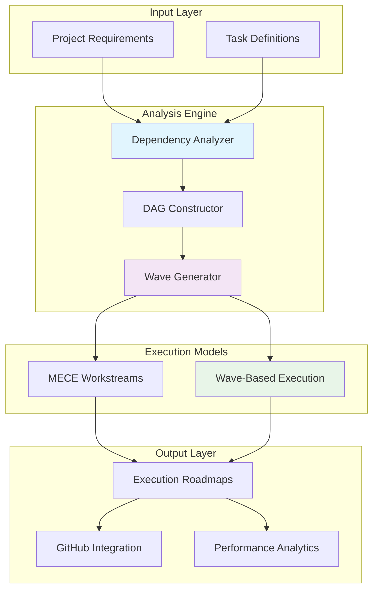

### System Components

#### 1. Dependency Analysis Engine
- **Technical Prerequisites**: Identifies code dependencies and infrastructure requirements
- **Sequential Requirements**: Determines logical ordering and workflow dependencies  
- **Infrastructure Dependencies**: Maps system and environment prerequisites
- **Resource Dependencies**: Analyzes team and resource allocation needs

#### 2. Execution Model Generator
- **MECE Workstreams**: Creates mutually exclusive, collectively exhaustive team structures
- **Wave-Based Planning**: Generates thread.join() style execution phases
- **Team Optimization**: Calculates optimal team size and composition
- **Synchronization Strategy**: Defines coordination points and handoff protocols

#### 3. GitHub Integration Layer
- **Issue Creation**: Automatically generates GitHub issues for each task
- **Project Boards**: Creates and populates project management boards
- **Progress Tracking**: Real-time synchronization with development progress
- **Documentation Generation**: Produces comprehensive execution documentation

---

## Core Concepts

### Dependency Analysis

The system analyzes four types of dependencies to create accurate execution plans:

#### Technical Prerequisites
Dependencies based on code architecture and implementation requirements.

**Example**: Cross-platform temp directory detection must be implemented before platform-specific test cases can be created.

```json
{
  "from": "P1.T006",
  "to": "P1.T002", 
  "reason": "platform-specific tests need cross-platform implementation"
}
```

#### Sequential Requirements
Dependencies based on logical workflow ordering and information flow.

**Example**: Error framework must exist before structured error messages can be implemented.

```json
{
  "from": "P1.T025",
  "to": "P1.T024",
  "reason": "structured error messages need error codes"
}
```

#### Infrastructure Dependencies
Dependencies based on system setup and environmental requirements.

**Example**: Testing environments must be configured before platform-specific tests can run.

```json
{
  "from": "P1.T006",
  "to": "P1.T005",
  "reason": "platform-specific tests need test environments set up"
}
```

#### Resource Dependencies
Dependencies based on team coordination and knowledge transfer needs.

**Example**: Beta testing group must be identified before beta testing instructions can be created.

```json
{
  "from": "P1.T058",
  "to": "P1.T057",
  "reason": "beta testing instructions need beta testing group"
}
```

### MECE Principles

**Mutually Exclusive, Collectively Exhaustive** workstream organization ensures optimal team coordination:

- **Mutually Exclusive**: No overlapping responsibilities between workstreams
- **Collectively Exhaustive**: Every task assigned to exactly one workstream  
- **Minimal Coordination**: Reduced cross-stream dependencies and handoffs
- **Optimal Distribution**: Balanced workload across specialized teams

### Wave-Based Execution

A **thread.join()** style execution model that eliminates coordination overhead:

- **Complete Independence**: All tasks within a wave can execute simultaneously
- **Hard Synchronization**: All teams must complete current wave before proceeding
- **Linear Scaling**: More teams directly reduce wave completion time
- **Predictable Timelines**: Clear milestones with minimal coordination overhead

---

## MECE vs Wave-Based Execution

### Comparison Overview

| Aspect | MECE Approach | Wave-Based Approach | Improvement |
|--------|---------------|-------------------|-------------|
| **Coordination Points** | Multiple daily syncs | 2 total project syncs | 📉 85% reduction |
| **Team Independence** | Cross-stream coordination | Complete wave independence | 🚀 Zero blocking |
| **Scaling Model** | Limited by stream structure | Linear wave scaling | 📈 Unlimited teams |
| **Team Utilization** | ~75% (coordination overhead) | >95% (pure execution) | ⚡ 20% efficiency gain |
| **Risk Management** | Distributed risk points | Concentrated at wave barriers | 🎯 Cleaner isolation |

### MECE Workstream Model

Organizes teams by functional expertise with coordinated handoffs:

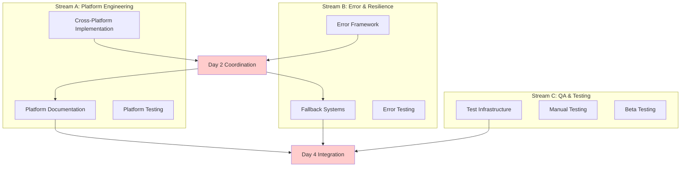

**Characteristics:**
- **Duration**: 6-8 days with 4-5 developer team
- **Coordination**: Daily standups + 2 major sync points
- **Scaling**: Limited by stream dependencies
- **Best For**: Teams with strong functional specialization

### Wave-Based Execution Model

Organizes tasks by dependency levels with complete intra-wave independence:

```mermaid
graph TB
    subgraph "Wave 1: Foundation (18 tasks)"
        W1[Complete Independence<br/>Zero Dependencies]
    end
    
    subgraph "Wave 2: Implementation (46 tasks)"  
        W2[Complete Independence<br/>Depends only on Wave 1]
    end
    
    subgraph "Wave 3: Integration (20 tasks)"
        W3[Complete Independence<br/>Depends only on Wave 1+2]
    end
    
    W1 --> SYNC1[🔄 thread.join()<br/>ALL Wave 1 Complete]
    W2 --> SYNC2[🔄 thread.join()<br/>ALL Wave 2 Complete]
    
    SYNC1 --> W2
    SYNC2 --> W3
    
    style SYNC1 fill:#99ff99
    style SYNC2 fill:#99ff99
```

**Characteristics:**
- **Duration**: 3-7 days (scales with team size)
- **Coordination**: 2 hard synchronization points only
- **Scaling**: Linear - unlimited team additions within waves
- **Best For**: Large teams, rapid execution, minimal coordination overhead

### Migration Strategy

Converting existing MECE plans to wave-based execution:

#### Step 1: Dependency Analysis
```bash
# Analyze true technical dependencies
claude-plan analyze-dependencies --input tasks.md --output dependencies.json

# Generate DAG structure  
claude-plan build-dag --dependencies dependencies.json --output task_dag.json
```

#### Step 2: Wave Generation
```bash
# Create wave structure from DAG
claude-plan generate-waves --dag task_dag.json --output task_waves.json

# Validate wave independence
claude-plan validate-waves --waves task_waves.json
```

#### Step 3: Team Assignment
```bash
# Generate team assignments for waves
claude-plan assign-teams --waves task_waves.json --team-size 8 --output team_plan.md
```

---

## Dependency Analysis Engine

### DAG Construction Process

The system constructs a Directed Acyclic Graph (DAG) representing all task dependencies:

#### 1. Input Processing
- **Task Definitions**: Parses structured task lists with descriptions and requirements
- **Requirement Analysis**: Extracts implicit dependencies from task descriptions
- **Context Understanding**: Analyzes technical context and project domain

#### 2. Dependency Identification
```json
{
  "metadata": {
    "analysis_date": "2025-08-12",
    "total_tasks": 84,
    "dependency_analysis": "Based on technical prerequisites, sequential requirements, infrastructure dependencies, and logical ordering"
  },
  "edges": [
    {
      "id": "t002-t001",
      "from": "P1.T002", 
      "to": "P1.T001",
      "reason": "temp directory implementation needs research foundation"
    }
  ]
}
```

#### 3. Critical Path Analysis
```json
{
  "critical_paths": [
    {
      "description": "Core Implementation Path",
      "tasks": ["P1.T001", "P1.T002", "P1.T003", "P1.T004"],
      "rationale": "Foundation for all cross-platform functionality"
    }
  ]
}
```

### Dependency Types

#### Technical Prerequisites
Code and implementation dependencies:

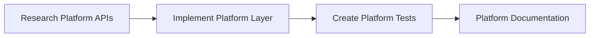

#### Sequential Requirements  
Logical workflow ordering:

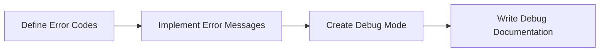

#### Infrastructure Dependencies
Environment and setup requirements:

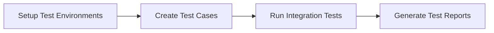

### Root Task Identification

Tasks with zero dependencies that can start immediately:

```json
{
  "root_tasks": [
    "P1.T001",  // Research platform conventions
    "P1.T005",  // Set up testing environments  
    "P1.T013",  // Implement cleanup on completion
    "P1.T017",  // Check available disk space
    "P1.T021",  // Add verbose mode
    "P1.T024",  // Create error codes
    "P1.T028",  // Define graceful degradation
    "P1.T037",  // Update README with installation
    "P1.T041",  // Common error scenarios
    "P1.T049",  // Expand test suite
    "P1.T053",  // Create manual test checklist
    "P1.T057",  // Identify beta testing group
    "P1.T061",  // Review implementation for edge cases
    "P1.T065",  // Add configuration file support
    "P1.T069",  // Implement optional logging
    "P1.T073",  // Create release artifacts
    "P1.T077",  // Update repository description
    "P1.T081"   // Identify community advocates
  ]
}
```

---

## Wave-Based Execution Model

### Wave Structure

#### Wave 1: Foundation (18 Tasks)
**Duration**: 1-2 days  
**Characteristics**: Zero dependencies, pure parallel execution

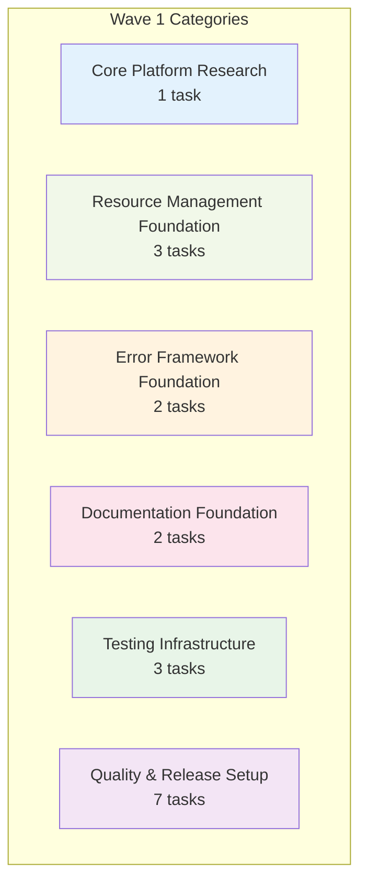

**Team Scaling Options:**
- **3 Teams**: 6 tasks each, complete in 1-2 days
- **6 Teams**: 3 tasks each, complete in 1 day
- **18 Teams**: 1 task each, complete in hours

#### Wave 2: Implementation (46 Tasks)
**Duration**: 2-3 days  
**Characteristics**: Depends only on Wave 1 completion

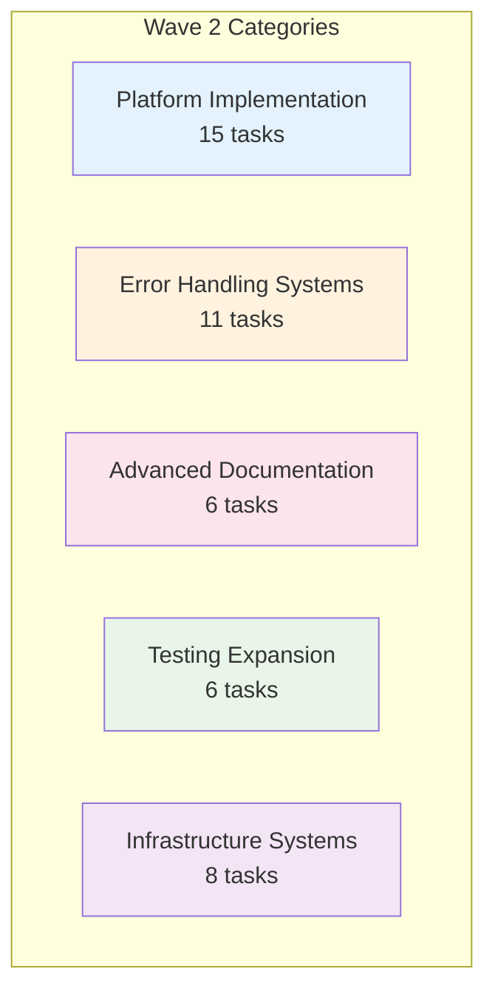

**Team Scaling Options:**
- **5 Teams**: Specialized by category (8-15 tasks each)
- **10 Teams**: Balanced load (4-5 tasks each)
- **15+ Teams**: Maximum parallelization (2-3 tasks each)

#### Wave 3: Integration (20 Tasks)
**Duration**: 1-2 days  
**Characteristics**: Depends only on Wave 1+2 completion

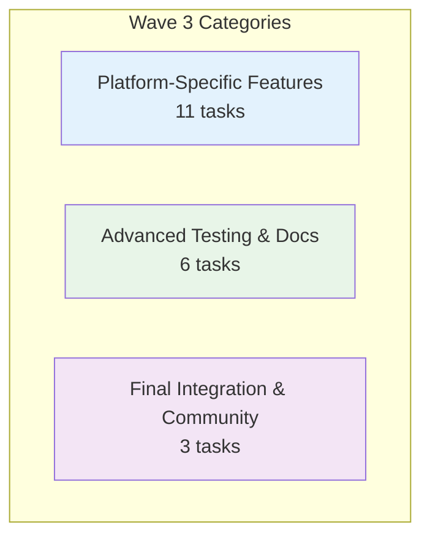

### Synchronization Protocol

#### Thread.Join() Implementation

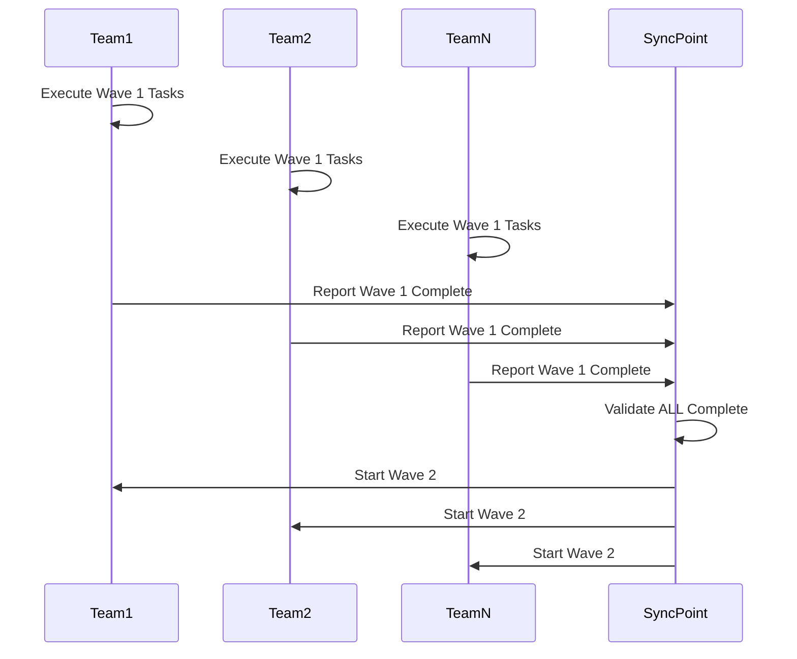

#### Sync Point Activities

**Sync Point 1: Foundation → Implementation**
- **Duration**: 30-60 minutes
- **Activities**:
  - Validate research completion and accuracy
  - Verify testing environment setup
  - Confirm error framework foundation
  - Check documentation baseline
  - Approve team assignments for Wave 2

**Sync Point 2: Implementation → Integration**
- **Duration**: 1-2 hours  
- **Activities**:
  - Comprehensive integration testing
  - Cross-platform compatibility validation
  - Error handling system verification
  - Documentation completeness review
  - Beta readiness assessment

### Team Scaling Models

#### Small Team (3-5 Developers)
```mermaid
gantt
    title Small Team Wave Execution
    dateFormat X
    axisFormat %d
    
    section Wave 1
    Foundation Tasks    :w1, 0, 2d
    
    section Sync
    Wave 1→2 Sync      :sync1, after w1, 4h
    
    section Wave 2  
    Implementation     :w2, after sync1, 3d
    
    section Sync
    Wave 2→3 Sync      :sync2, after w2, 4h
    
    section Wave 3
    Integration        :w3, after sync2, 2d
```

**Duration**: 6-7 days  
**Coordination Overhead**: ~5% of total effort

#### Large Team (10+ Developers)
```mermaid
gantt
    title Large Team Wave Execution
    dateFormat X
    axisFormat %d
    
    section Wave 1
    Foundation Tasks    :w1, 0, 8h
    
    section Sync
    Wave 1→2 Sync      :sync1, after w1, 1h
    
    section Wave 2
    Implementation     :w2, after sync1, 1d
    
    section Sync
    Wave 2→3 Sync      :sync2, after w2, 1h
    
    section Wave 3
    Integration        :w3, after sync2, 8h
```

**Duration**: 3-4 days  
**Coordination Overhead**: <3% of total effort

---

## Command Reference

### Core Commands

#### Dependency Analysis
```bash
# Generate dependency analysis from task definitions
claude-plan analyze-dependencies [OPTIONS]

Options:
  --input FILE          Input task file (markdown/json)
  --output FILE         Output dependency file (json)
  --format FORMAT       Output format (json|mermaid|dot)
  --validate           Validate DAG structure
  --critical-path      Identify critical paths
```

**Example:**
```bash
claude-plan analyze-dependencies \
  --input TASKS.md \
  --output TASKS_DAG.json \
  --format json \
  --validate \
  --critical-path
```

#### Wave Generation
```bash
# Generate wave-based execution plan
claude-plan generate-waves [OPTIONS]

Options:
  --dag FILE           Input DAG file
  --output FILE        Output wave plan file
  --format FORMAT      Output format (json|markdown)
  --max-wave-size N    Maximum tasks per wave
  --team-size N        Target team size for estimates
```

**Example:**
```bash
claude-plan generate-waves \
  --dag TASKS_DAG.json \
  --output TASKS_WAVES.json \
  --format json \
  --team-size 8
```

#### MECE Planning
```bash
# Generate MECE workstream plan
claude-plan generate-mece [OPTIONS]

Options:
  --dag FILE           Input DAG file
  --output FILE        Output MECE plan file
  --streams N          Number of workstreams (3-6)
  --duration DAYS      Target project duration
  --team-size N        Team size per stream
```

**Example:**
```bash
claude-plan generate-mece \
  --dag TASKS_DAG.json \
  --output ROADMAP-mece.md \
  --streams 5 \
  --duration 7 \
  --team-size 3
```

#### GitHub Integration
```bash
# Create GitHub issues from execution plan
claude-plan github-create-issues [OPTIONS]

Options:
  --plan FILE          Input execution plan
  --repo OWNER/REPO    GitHub repository
  --token TOKEN        GitHub access token
  --label LABEL        Apply labels to issues
  --milestone NAME     Assign to milestone
  --project-board ID   Add to project board
```

**Example:**
```bash
claude-plan github-create-issues \
  --plan TASKS_WAVES.json \
  --repo myorg/myproject \
  --token $GITHUB_TOKEN \
  --label "phase-1" \
  --milestone "Q1-2025"
```

### Analysis Commands

#### Validate Plans
```bash
# Validate execution plan consistency
claude-plan validate [OPTIONS]

Options:
  --plan FILE          Execution plan to validate
  --type TYPE          Plan type (mece|waves)
  --check-deps         Verify dependency satisfaction
  --check-coverage     Verify all tasks covered
  --check-conflicts    Check for resource conflicts
```

#### Compare Plans
```bash
# Compare different execution strategies
claude-plan compare [OPTIONS]

Options:
  --plan1 FILE         First execution plan
  --plan2 FILE         Second execution plan
  --metrics TYPE       Comparison metrics (time|coordination|risk)
  --output FILE        Comparison report output
```

#### Generate Reports
```bash
# Generate execution analytics and reports
claude-plan report [OPTIONS]

Options:
  --plan FILE          Execution plan
  --type TYPE          Report type (summary|detailed|metrics)
  --format FORMAT      Output format (markdown|html|pdf)
  --include-diagrams   Include visual diagrams
```

---

## Getting Started

### Quick Start Guide

#### Prerequisites
- **Node.js**: Version 16+ for execution engine
- **Git**: For repository management and GitHub integration
- **GitHub CLI**: Optional for enhanced GitHub integration

#### Installation
```bash
# Install via npm
npm install -g claude-plan-mece-waves

# Or clone from repository
git clone https://github.com/org/claude-plan-mece-waves.git
cd claude-plan-mece-waves
npm install
npm link
```

#### Basic Workflow

**Step 1: Create Task Definitions**
Create a structured task file (markdown or JSON):

```markdown
# Project Tasks

## Core Features
- [ ] T001 Implement user authentication
- [ ] T002 Create user dashboard (depends on T001)
- [ ] T003 Add user preferences (depends on T002)

## Testing
- [ ] T004 Setup test environment
- [ ] T005 Create authentication tests (depends on T001, T004)
- [ ] T006 Create dashboard tests (depends on T002, T004)
```

**Step 2: Generate Dependency Analysis**
```bash
claude-plan analyze-dependencies --input tasks.md --output deps.json
```

**Step 3: Choose Execution Model**

For wave-based execution:
```bash
claude-plan generate-waves --dag deps.json --output waves.json
```

For MECE workstreams:
```bash
claude-plan generate-mece --dag deps.json --output mece.md
```

**Step 4: Create GitHub Issues (Optional)**
```bash
claude-plan github-create-issues --plan waves.json --repo myorg/myproject
```

### Configuration

#### Configuration File
Create `.claude-plan.json` in your project root:

```json
{
  "execution": {
    "model": "waves",
    "team_size": 6,
    "max_wave_size": 50
  },
  "github": {
    "auto_create_issues": true,
    "label_prefix": "claude-plan",
    "use_milestones": true
  },
  "output": {
    "format": "markdown",
    "include_diagrams": true,
    "template_dir": "./templates"
  }
}
```

#### Environment Variables
```bash
export CLAUDE_PLAN_GITHUB_TOKEN="your_github_token"
export CLAUDE_PLAN_DEFAULT_TEAM_SIZE=8
export CLAUDE_PLAN_EXECUTION_MODEL="waves"
```

---

## Advanced Usage

### Custom Dependency Rules

#### Creating Custom Rules
Define custom dependency identification rules:

```json
{
  "custom_rules": [
    {
      "name": "testing_dependencies",
      "pattern": "test.*{feature}",
      "requires": ["implement.*{feature}", "setup.*test.*environment"],
      "reason": "Tests require implementation and test environment"
    },
    {
      "name": "documentation_dependencies", 
      "pattern": "document.*{feature}",
      "requires": ["implement.*{feature}"],
      "reason": "Documentation requires completed implementation"
    }
  ]
}
```

#### Domain-Specific Templates
Create reusable templates for common project types:

```bash
# Web application template
claude-plan template create web-app \
  --include-auth \
  --include-database \
  --include-api \
  --include-frontend

# Microservice template  
claude-plan template create microservice \
  --include-docker \
  --include-kubernetes \
  --include-monitoring
```

### Advanced Team Optimization

#### Dynamic Team Assignment
```bash
# Optimize team assignments based on skills
claude-plan optimize-teams [OPTIONS]

Options:
  --plan FILE          Execution plan
  --skills FILE        Team skills matrix
  --constraints FILE   Resource constraints
  --optimize-for TYPE  Optimization target (time|cost|quality)
```

**Skills Matrix Example:**
```json
{
  "team_members": [
    {
      "name": "Alice",
      "skills": ["frontend", "react", "typescript"],
      "availability": 0.8,
      "seniority": "senior"
    },
    {
      "name": "Bob", 
      "skills": ["backend", "node", "databases"],
      "availability": 1.0,
      "seniority": "mid"
    }
  ]
}
```

#### Resource Constraint Modeling
```json
{
  "constraints": [
    {
      "type": "exclusive_resource",
      "resource": "staging_environment",
      "max_concurrent": 1,
      "applies_to": ["integration_tests", "performance_tests"]
    },
    {
      "type": "skill_requirement",
      "skill": "devops",
      "min_level": "senior",
      "applies_to": ["deployment", "infrastructure"]
    }
  ]
}
```

### Integration Patterns

#### CI/CD Integration
```yaml
# .github/workflows/claude-plan.yml
name: Claude Plan Execution
on:
  push:
    branches: [main]
    paths: ['TASKS.md']

jobs:
  update-plan:
    runs-on: ubuntu-latest
    steps:
      - uses: actions/checkout@v3
      - uses: actions/setup-node@v3
        with:
          node-version: '18'
      
      - name: Install Claude Plan
        run: npm install -g claude-plan-mece-waves
      
      - name: Generate Execution Plan
        run: |
          claude-plan analyze-dependencies --input TASKS.md --output deps.json
          claude-plan generate-waves --dag deps.json --output waves.json
      
      - name: Update GitHub Issues
        run: |
          claude-plan github-create-issues \
            --plan waves.json \
            --repo ${{ github.repository }} \
            --token ${{ secrets.GITHUB_TOKEN }}
```

#### Slack Integration
```bash
# Post execution plan updates to Slack
claude-plan notify slack [OPTIONS]

Options:
  --webhook URL        Slack webhook URL
  --channel CHANNEL    Target channel
  --plan FILE          Execution plan to report
  --event TYPE         Event type (plan_updated|wave_complete|sync_point)
```

#### Jira Integration
```bash
# Sync with Jira projects
claude-plan jira sync [OPTIONS]

Options:
  --plan FILE          Execution plan
  --project KEY        Jira project key
  --epic EPIC          Parent epic for tasks
  --status-mapping FILE Status mapping configuration
```

---

## Use Cases & Examples

### Use Case 1: Solo Developer Planning

**Scenario**: Individual developer planning a complex feature implementation

**Input**: 
```markdown
# User Authentication Feature

## Backend Implementation
- [ ] Setup authentication database schema
- [ ] Implement JWT token generation
- [ ] Create user registration endpoint
- [ ] Create user login endpoint
- [ ] Add password reset functionality

## Frontend Implementation  
- [ ] Create login form component
- [ ] Create registration form component
- [ ] Implement authentication state management
- [ ] Add protected route handling
- [ ] Create user profile component

## Testing & Documentation
- [ ] Write unit tests for auth endpoints
- [ ] Write integration tests for auth flow
- [ ] Create API documentation
- [ ] Write user documentation
```

**Generated Wave Plan**:
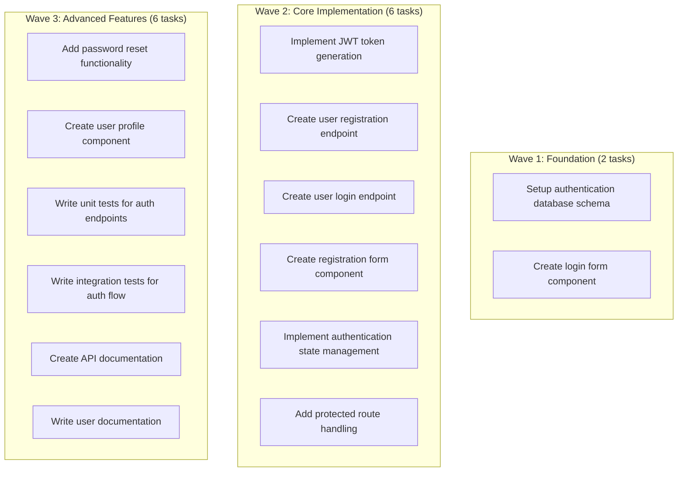

**Benefits for Solo Developer**:
- Clear prioritization and dependency visualization
- Realistic timeline estimation (3-4 days with proper dependency handling)
- Reduced context switching between unrelated tasks
- Natural checkpoint structure for progress tracking

### Use Case 2: Team Lead Coordination

**Scenario**: 8-person team implementing microservice architecture

**Team Structure**:
- 2 Backend developers
- 2 Frontend developers  
- 2 DevOps engineers
- 1 QA engineer
- 1 Tech writer

**Generated MECE Plan**:
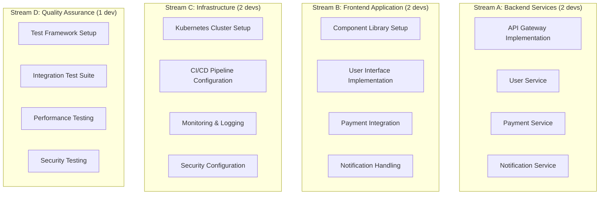

**Coordination Strategy**:
- **Day 2**: Backend API contracts shared with Frontend team
- **Day 4**: Infrastructure ready for deployment integration
- **Day 6**: Full integration testing with all components

**Benefits for Team Lead**:
- Clear workstream boundaries with minimal cross-dependencies
- Predictable coordination points (2 major syncs vs daily coordination)
- Balanced workload distribution across specialist teams
- Built-in quality gates at natural project milestones

### Use Case 3: Large Organization Scaling

**Scenario**: 20+ developer organization implementing enterprise platform

**Challenge**: 
- Multiple product teams with shared dependencies
- Complex integration requirements
- Strict compliance and security requirements
- Distributed team across timezones

**Generated Wave Plan for Scale**:

**Wave 1: Platform Foundation (5 days)**
- 4 parallel teams working on independent foundation components
- Team assignments by expertise (Platform, Security, Data, Documentation)
- Zero cross-team dependencies during execution

**Wave 2: Core Services Implementation (7 days)**
- 8 parallel teams implementing microservices
- Each team owns 2-3 related services end-to-end
- Complete independence enabled by Wave 1 foundations

**Wave 3: Integration & Optimization (3 days)**
- 6 parallel teams handling integration scenarios
- Platform-specific optimizations and edge cases
- Final compliance and security validation

**Scaling Benefits**:
- **Linear scaling**: Adding teams directly reduces timeline
- **Timezone distribution**: Teams in different timezones can work same wave
- **Risk mitigation**: Issues isolated to individual teams, not entire project
- **Quality control**: Hard sync points ensure integration validation

### Use Case 4: Open Source Project Management

**Scenario**: Managing community contributions to complex open source project

**Challenge**:
- Contributors with varying skill levels and availability
- Need for clear, bite-sized tasks for new contributors
- Maintaining project coherence across distributed development
- Balancing feature development with maintenance

**Generated Community Plan**:
```markdown
## Wave 1: Community Foundation (Open to all contributors)
### Good First Issues (6 tasks)
- Documentation improvements
- Test coverage expansion  
- Code style consistency
- Example application updates

### Experienced Contributors (8 tasks)
- Core API design
- Architecture documentation
- Testing framework setup
- Community guidelines

## Wave 2: Feature Implementation (Skill-based assignment)
### Frontend Specialists (12 tasks)
- UI component development
- User experience improvements
- Accessibility enhancements
- Mobile responsiveness

### Backend Specialists (15 tasks)  
- API endpoint implementation
- Database optimization
- Performance improvements
- Security enhancements

## Wave 3: Integration & Release (Maintainer coordination)
### Integration Tasks (8 tasks)
- Cross-component testing
- Performance validation
- Security audit
- Release preparation
```

**Community Benefits**:
- **Clear entry points**: Well-defined tasks for different skill levels
- **Independent contribution**: Contributors can work without blocking others
- **Maintainer efficiency**: Reduced coordination overhead for maintainers
- **Quality assurance**: Natural integration points for code review and validation

---

## Best Practices

### Dependency Analysis Best Practices

#### 1. Start with High-Level Dependencies
Begin dependency analysis with major architectural components before diving into implementation details.

**Good Example**:
```
Database Schema → API Layer → Business Logic → UI Components → Integration Tests
```

**Poor Example**:
```
Variable naming → Function implementation → Module structure → API design
```

#### 2. Distinguish True Dependencies from Preferences
Focus on technical necessities rather than workflow preferences.

**True Dependency**: "Integration tests require API endpoints to be implemented"
**Preference**: "We prefer to implement authentication before user management"

#### 3. Use Consistent Granularity
Maintain similar levels of detail across all tasks in your dependency analysis.

**Consistent Granularity**:
- ✅ "Implement user authentication API"
- ✅ "Create user registration form"
- ✅ "Setup authentication testing"

**Inconsistent Granularity**:
- ❌ "Build entire authentication system"
- ❌ "Change button color to blue"
- ❌ "Setup testing"

#### 4. Validate Circular Dependencies
Always check for and resolve circular dependencies before finalizing plans.

```bash
# Check for circular dependencies
claude-plan validate --plan deps.json --check-cycles

# Visualize dependency graph to spot issues
claude-plan report --plan deps.json --format mermaid --include-diagrams
```

### Wave Planning Best Practices

#### 1. Optimize Wave Size
Balance wave independence with practical team coordination.

**Wave Size Guidelines**:
- **Small waves (5-15 tasks)**: Better for small teams, frequent validation
- **Medium waves (15-30 tasks)**: Optimal for most team sizes
- **Large waves (30+ tasks)**: Only for large teams with strong coordination

#### 2. Design for Team Strengths
Align wave structure with your team's natural working patterns.

**Specialist Teams**: Create waves that allow teams to work within their expertise
**Generalist Teams**: Create waves with diverse tasks for knowledge sharing
**Mixed Teams**: Balance specialized and cross-functional work within waves

#### 3. Plan Realistic Sync Points
Design synchronization points that provide meaningful validation opportunities.

**Effective Sync Points**:
- ✅ After foundational components are complete
- ✅ Before integration-dependent work begins
- ✅ At natural architectural boundaries

**Ineffective Sync Points**:
- ❌ Arbitrary calendar milestones
- ❌ Individual task completions
- ❌ Status meeting schedules

#### 4. Build in Quality Gates
Use wave boundaries as natural quality validation points.

```markdown
## Wave 1 → Wave 2 Transition Checklist
- [ ] All foundation components pass unit tests
- [ ] API contracts defined and documented
- [ ] Development environments configured
- [ ] Team assignments for Wave 2 confirmed

## Wave 2 → Wave 3 Transition Checklist  
- [ ] Core functionality implemented and tested
- [ ] Integration interfaces working
- [ ] Performance baselines established
- [ ] Security review completed
```

### Team Coordination Best Practices

#### 1. Establish Clear Communication Protocols
Define how teams communicate within waves and at sync points.

**Within Wave Communication**:
- Asynchronous updates via shared documentation
- Direct team-to-team communication for immediate blockers
- Minimal formal coordination meetings

**Sync Point Communication**:
- Structured validation sessions
- Cross-team integration verification
- Decision-making for next wave assignments

#### 2. Use Automated Validation
Implement automated checks to validate wave completion and readiness.

```yaml
# Automated Wave Validation
wave_completion_checks:
  - name: "All tasks completed"
    type: "task_status_check"
    threshold: "100%"
  
  - name: "Tests passing"
    type: "ci_status_check" 
    required_status: "success"
  
  - name: "Code review complete"
    type: "pr_status_check"
    required_approvals: 2
```

#### 3. Design Flexible Team Assignments
Allow teams to dynamically pick up work within their current wave.

**Dynamic Assignment Strategy**:
```markdown
## Wave 2 Available Tasks
### High Priority (Complete first)
- [ ] P1.T025 - Platform authentication (Backend team priority)
- [ ] P1.T039 - User interface design (Frontend team priority)

### Medium Priority (Any team can take)
- [ ] P1.T044 - Documentation updates
- [ ] P1.T052 - Test framework expansion

### Low Priority (If time permits)
- [ ] P1.T070 - Performance optimizations
- [ ] P1.T072 - Usage analytics
```

#### 4. Maintain Momentum Between Waves
Keep teams engaged during sync point transitions.

**Transition Activities**:
- Code review and cleanup from current wave
- Planning and preparation for next wave
- Knowledge sharing sessions
- Technical debt addressing

### Quality Assurance Best Practices

#### 1. Integrate Quality Gates into Wave Structure
Build quality validation directly into the wave progression model.

**Wave-Integrated Quality**:
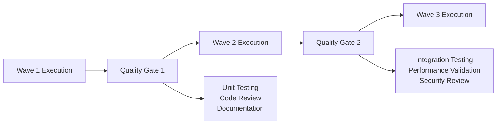

#### 2. Use Parallel Quality Tracks
Run quality assurance activities in parallel with development waves.

**Parallel QA Strategy**:
- **Wave 1**: Setup testing infrastructure, define quality standards
- **Wave 2**: Validate Wave 1 outputs while Wave 2 develops
- **Wave 3**: Validate Wave 2 outputs while Wave 3 develops

#### 3. Implement Continuous Validation
Don't wait for wave completion to start quality validation.

```bash
# Continuous validation automation
claude-plan monitor [OPTIONS]

Options:
  --plan FILE          Execution plan to monitor
  --quality-gates FILE Quality gate definitions
  --alert-webhook URL  Notification webhook for quality issues
  --continuous         Run continuous monitoring
```

### Documentation Best Practices

#### 1. Generate Living Documentation
Create documentation that updates automatically with plan changes.

**Auto-Generated Documentation**:
- Wave execution status dashboards
- Dependency visualization updates
- Team assignment tracking
- Progress reporting

#### 2. Maintain Decision Context
Document the reasoning behind planning decisions for future reference.

```markdown
## Planning Decision Log

### Wave Structure Decision
**Date**: 2025-08-12
**Decision**: Use 3-wave structure instead of 5-wave
**Reasoning**: Team size (8 developers) optimizes for larger waves with fewer sync points
**Alternatives Considered**: 5-wave structure, MECE workstreams
**Decision Maker**: Tech Lead
```

#### 3. Create Onboarding Materials
Ensure new team members can quickly understand and contribute to the execution plan.

**Onboarding Checklist**:
- [ ] Review current wave objectives and tasks
- [ ] Understand team assignment and responsibilities  
- [ ] Access development environment and tools
- [ ] Review quality standards and processes
- [ ] Identify initial tasks to contribute to

---

## Troubleshooting

### Common Issues and Solutions

#### Issue: Circular Dependencies Detected
**Symptoms**: Wave generation fails with circular dependency error
**Diagnosis**: 
```bash
claude-plan validate --plan deps.json --check-cycles --verbose
```
**Solutions**:
1. **Redesign task breakdown**: Split complex tasks that create circular references
2. **Redefine dependencies**: Distinguish between hard technical dependencies and soft preferences
3. **Introduce intermediate tasks**: Break circular chains with intermediate deliverables

**Example Fix**:
```markdown
# Before (Circular)
- Task A: Implement user interface (depends on Task B)  
- Task B: Design API endpoints (depends on Task A)

# After (Resolved)
- Task A1: Define interface requirements
- Task B1: Design API endpoints (depends on Task A1)
- Task A2: Implement user interface (depends on Task B1)
```

#### Issue: Wave Imbalance
**Symptoms**: One wave significantly larger than others, poor team utilization
**Diagnosis**:
```bash
claude-plan analyze-balance --plan waves.json --report balance.md
```
**Solutions**:
1. **Redistribute tasks**: Move independent tasks to balance wave sizes
2. **Split large waves**: Break oversized waves into multiple phases
3. **Combine small waves**: Merge small waves if no dependencies prevent it

**Rebalancing Example**:
```bash
# Analyze current balance
claude-plan analyze-balance --plan waves.json

# Rebalance automatically
claude-plan rebalance --plan waves.json --target-size 25 --output balanced_waves.json
```

#### Issue: Team Assignment Conflicts
**Symptoms**: Multiple teams assigned overlapping or conflicting tasks
**Diagnosis**:
```bash
claude-plan validate --plan team_assignments.json --check-conflicts
```
**Solutions**:
1. **Clarify task ownership**: Ensure each task has single clear owner
2. **Redesign team boundaries**: Adjust team composition to eliminate overlaps
3. **Add coordination tasks**: Explicitly plan coordination between interdependent teams

#### Issue: Sync Point Bottlenecks
**Symptoms**: Long delays at wave transitions, teams waiting for validation
**Diagnosis**: 
- Review sync point duration vs wave execution time
- Analyze validation complexity and requirements
**Solutions**:
1. **Parallel validation**: Run validation activities in parallel with current wave
2. **Automated checks**: Replace manual validation with automated testing
3. **Incremental validation**: Validate components as they complete rather than batch validation

**Optimization Example**:
```yaml
# Parallel sync point validation
sync_optimization:
  validation_strategy: "parallel"
  automated_checks:
    - unit_tests
    - integration_tests
    - code_quality_gates
  manual_validation:
    - architecture_review
    - security_audit
  max_sync_duration: "4 hours"
```

### Performance Optimization

#### Optimizing Dependency Analysis
**Issue**: Slow dependency analysis for large projects
**Solutions**:
1. **Incremental analysis**: Only reanalyze changed tasks
2. **Parallel processing**: Use multiple threads for dependency calculation
3. **Caching**: Cache dependency analysis results

```bash
# Enable performance optimizations
claude-plan analyze-dependencies \
  --input TASKS.md \
  --incremental \
  --parallel-threads 4 \
  --cache-dir ./.claude-plan-cache
```

#### Optimizing Wave Generation
**Issue**: Long wave generation times for complex dependency graphs
**Solutions**:
1. **Prune unnecessary dependencies**: Remove non-critical dependencies to simplify graph
2. **Use approximation algorithms**: Accept near-optimal solutions for very large projects
3. **Hierarchical planning**: Plan at multiple levels of granularity

```bash
# Use fast approximation for large projects
claude-plan generate-waves \
  --dag large_project.json \
  --algorithm fast \
  --approximation-level 0.95 \
  --max-iterations 1000
```

### Integration Issues

#### GitHub Integration Problems
**Issue**: Failed to create GitHub issues or update project boards

**Common Causes & Solutions**:

1. **Authentication Issues**
   ```bash
   # Verify token permissions
   curl -H "Authorization: token $GITHUB_TOKEN" https://api.github.com/user
   
   # Required permissions: repo, read:org, project
   ```

2. **Rate Limiting**
   ```bash
   # Check rate limit status
   claude-plan github-status --token $GITHUB_TOKEN
   
   # Use batch operations to reduce API calls
   claude-plan github-create-issues --batch-size 10 --delay 1000
   ```

3. **Repository Access Issues**
   ```bash
   # Verify repository access
   claude-plan github-test-access --repo owner/repo --token $GITHUB_TOKEN
   ```

#### Slack/Teams Integration Problems
**Issue**: Notifications not reaching team channels

**Solutions**:
1. **Webhook Validation**
   ```bash
   # Test webhook connectivity
   claude-plan test-webhook --url $SLACK_WEBHOOK --message "Test notification"
   ```

2. **Permission Issues**
   - Verify bot permissions in Slack/Teams
   - Check channel access for notification bot
   - Validate webhook URL format

3. **Message Formatting**
   ```bash
   # Use platform-specific formatting
   claude-plan notify slack --format slack --plan waves.json
   claude-plan notify teams --format teams --plan waves.json
   ```

### Data Validation Issues

#### Invalid Task Definitions
**Issue**: Task parsing fails or produces incorrect dependencies

**Common Problems & Fixes**:

1. **Inconsistent Task IDs**
   ```markdown
   # Wrong: Inconsistent numbering
   - [ ] P1.T01 First task
   - [ ] P1.T002 Second task
   - [ ] P1.T3 Third task
   
   # Correct: Consistent format
   - [ ] P1.T001 First task
   - [ ] P1.T002 Second task
   - [ ] P1.T003 Third task
   ```

2. **Missing Dependency Information**
   ```markdown
   # Add explicit dependency information
   - [ ] P1.T002 Implement API endpoints (depends on P1.T001)
   - [ ] P1.T003 Create UI components (depends on P1.T002)
   ```

3. **Ambiguous Task Descriptions**
   ```markdown
   # Wrong: Ambiguous
   - [ ] P1.T001 Fix the authentication issue
   
   # Correct: Specific
   - [ ] P1.T001 Implement JWT token validation in authentication middleware
   ```

#### Configuration Validation
**Issue**: Invalid configuration leads to unexpected behavior

**Validation Checklist**:
```bash
# Validate configuration file
claude-plan validate-config --config .claude-plan.json

# Check team size constraints
claude-plan validate-teams --plan waves.json --min-team-size 2 --max-team-size 10

# Verify resource constraints
claude-plan validate-resources --plan waves.json --constraints resources.json
```

### Recovery Procedures

#### Mid-Wave Crisis Recovery
**Scenario**: Critical issue discovered during wave execution

**Recovery Steps**:
1. **Assess Impact**
   ```bash
   # Analyze impact of stopping current wave
   claude-plan impact-analysis --current-wave 2 --issue "critical-security-flaw"
   ```

2. **Emergency Replanning**
   ```bash
   # Generate emergency replan
   claude-plan emergency-replan \
     --current-state current_progress.json \
     --issue-description "security vulnerability requires architecture change" \
     --output emergency_plan.json
   ```

3. **Team Communication**
   ```bash
   # Notify all teams of plan changes
   claude-plan notify-emergency \
     --plan emergency_plan.json \
     --message "Critical security issue requires immediate replanning" \
     --channels slack,email
   ```

#### Wave Failure Recovery
**Scenario**: Sync point validation fails, wave cannot complete

**Recovery Options**:
1. **Partial Wave Completion**
   ```bash
   # Complete wave with subset of tasks
   claude-plan partial-complete \
     --wave 2 \
     --completed-tasks "P1.T025,P1.T026,P1.T027" \
     --deferred-tasks "P1.T028,P1.T029"
   ```

2. **Wave Rollback**
   ```bash
   # Rollback to previous stable state
   claude-plan rollback \
     --target-wave 1 \
     --backup-state backup_wave1.json
   ```

3. **Alternative Path Planning**
   ```bash
   # Generate alternative execution path
   claude-plan alternative-path \
     --failed-tasks "P1.T028,P1.T029" \
     --available-resources "team1,team2" \
     --constraints "7-day-deadline"
   ```

---

## Architecture & Design

### System Architecture

#### Component Overview
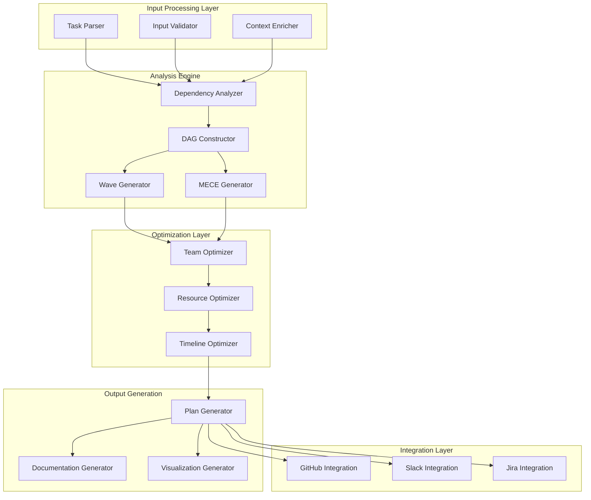

#### Core Algorithms

**Dependency Analysis Algorithm**
```typescript
interface DependencyAnalysis {
  analyzeDependencies(tasks: Task[]): DependencyGraph {
    const graph = new DependencyGraph();
    
    // Phase 1: Parse explicit dependencies
    for (const task of tasks) {
      const explicitDeps = this.parseExplicitDependencies(task);
      graph.addDependencies(task.id, explicitDeps);
    }
    
    // Phase 2: Infer implicit dependencies
    for (const task of tasks) {
      const implicitDeps = this.inferDependencies(task, tasks);
      graph.addDependencies(task.id, implicitDeps);
    }
    
    // Phase 3: Validate and optimize
    this.validateAcyclic(graph);
    this.optimizeDependencies(graph);
    
    return graph;
  }
}
```

**Wave Generation Algorithm**
```typescript
interface WaveGeneration {
  generateWaves(graph: DependencyGraph): Wave[] {
    const waves: Wave[] = [];
    const remaining = new Set(graph.getAllNodes());
    
    while (remaining.size > 0) {
      // Find nodes with no remaining dependencies
      const currentWave = [];
      for (const node of remaining) {
        if (this.hasNoDependencies(node, remaining)) {
          currentWave.push(node);
        }
      }
      
      // Remove current wave nodes from remaining
      for (const node of currentWave) {
        remaining.delete(node);
      }
      
      waves.push(new Wave(currentWave));
    }
    
    return waves;
  }
}
```

### Data Models

#### Task Definition Model
```typescript
interface Task {
  id: string;                    // Unique task identifier (e.g., "P1.T001")
  title: string;                 // Human-readable task name
  description: string;           // Detailed task description
  category: string;              // Task category for organization
  estimatedHours: number;        // Effort estimation
  skillsRequired: string[];      // Required skills/competencies
  explicitDependencies: string[]; // Explicitly stated dependencies
  implicitDependencies: string[]; // Inferred dependencies
  priority: Priority;            // Task priority level
  status: TaskStatus;            // Current execution status
}

enum Priority {
  CRITICAL = "critical",
  HIGH = "high", 
  MEDIUM = "medium",
  LOW = "low"
}

enum TaskStatus {
  PENDING = "pending",
  IN_PROGRESS = "in_progress",
  COMPLETED = "completed",
  BLOCKED = "blocked"
}
```

#### Dependency Graph Model
```typescript
interface DependencyGraph {
  nodes: Map<string, Task>;
  edges: Map<string, Dependency>;
  
  addNode(task: Task): void;
  addDependency(from: string, to: string, reason: string): void;
  getDependencies(taskId: string): string[];
  getReverseDependencies(taskId: string): string[];
  validateAcyclic(): boolean;
  getCriticalPath(): string[];
}

interface Dependency {
  id: string;           // Unique dependency identifier
  from: string;         // Dependent task ID
  to: string;           // Prerequisite task ID
  reason: string;       // Human-readable dependency reason
  type: DependencyType; // Classification of dependency
  strength: number;     // Dependency strength (0.0-1.0)
}

enum DependencyType {
  TECHNICAL = "technical",
  SEQUENTIAL = "sequential", 
  INFRASTRUCTURE = "infrastructure",
  RESOURCE = "resource"
}
```

#### Wave Execution Model
```typescript
interface Wave {
  waveNumber: number;           // Sequential wave identifier
  tasks: Task[];                // Tasks in this wave
  estimatedDuration: Duration;  // Estimated wave completion time
  teamAssignments: TeamAssignment[]; // Team to task mappings
  syncRequirements: SyncRequirement[]; // Requirements for wave completion
}

interface TeamAssignment {
  teamId: string;
  tasks: string[];
  estimatedEffort: number;
  skillMatch: number;          // How well team skills match task requirements
}

interface SyncRequirement {
  type: SyncType;
  description: string;
  validationCriteria: ValidationCriteria[];
  estimatedDuration: Duration;
}

enum SyncType {
  VALIDATION = "validation",
  INTEGRATION = "integration",
  COORDINATION = "coordination"
}
```

### Performance Characteristics

#### Algorithmic Complexity

| Algorithm | Time Complexity | Space Complexity | Scaling Characteristics |
|-----------|----------------|------------------|------------------------|
| **Dependency Analysis** | O(n²) | O(n + e) | Quadratic with task count |
| **DAG Construction** | O(n + e) | O(n + e) | Linear with nodes + edges |
| **Wave Generation** | O(n + e) | O(n) | Linear with dependency graph size |
| **Team Optimization** | O(n × t × s) | O(n × t) | Polynomial with tasks, teams, skills |

Where:
- n = number of tasks
- e = number of dependencies  
- t = number of teams
- s = number of skills

#### Performance Benchmarks

**Small Projects (10-50 tasks)**
- Dependency analysis: <100ms
- Wave generation: <50ms
- Total processing: <500ms
- Memory usage: <10MB

**Medium Projects (50-200 tasks)**
- Dependency analysis: <500ms
- Wave generation: <200ms
- Total processing: <2s
- Memory usage: <50MB

**Large Projects (200-1000 tasks)**
- Dependency analysis: <5s
- Wave generation: <1s
- Total processing: <15s
- Memory usage: <200MB

#### Optimization Strategies

**Caching Strategy**
```typescript
interface CacheStrategy {
  dependencyCache: Map<string, DependencyResult>;
  waveCache: Map<string, Wave[]>;
  teamOptimizationCache: Map<string, TeamAssignment[]>;
  
  getCachedDependencies(taskHash: string): DependencyResult | null;
  cacheDependencies(taskHash: string, result: DependencyResult): void;
  invalidateCache(taskIds: string[]): void;
}
```

**Incremental Processing**
```typescript
interface IncrementalProcessor {
  processChanges(changes: TaskChange[]): ExecutionPlan {
    const affectedTasks = this.findAffectedTasks(changes);
    const updatedGraph = this.updateDependencyGraph(affectedTasks);
    const newWaves = this.regenerateWaves(updatedGraph);
    return this.optimizePlan(newWaves);
  }
}
```

### Extensibility Framework

#### Plugin Architecture
```typescript
interface PlanningPlugin {
  name: string;
  version: string;
  
  // Lifecycle hooks
  beforeDependencyAnalysis?(tasks: Task[]): Task[];
  afterDependencyAnalysis?(graph: DependencyGraph): DependencyGraph;
  beforeWaveGeneration?(graph: DependencyGraph): DependencyGraph;
  afterWaveGeneration?(waves: Wave[]): Wave[];
  
  // Custom algorithms
  customDependencyAnalyzer?: DependencyAnalyzer;
  customWaveGenerator?: WaveGenerator;
  customTeamOptimizer?: TeamOptimizer;
}
```

**Example Plugin: Domain-Specific Rules**
```typescript
class WebAppPlanningPlugin implements PlanningPlugin {
  name = "web-app-planning";
  version = "1.0.0";
  
  afterDependencyAnalysis(graph: DependencyGraph): DependencyGraph {
    // Add web-app specific dependency rules
    this.addFrontendBackendDependencies(graph);
    this.addDatabaseMigrationDependencies(graph);
    this.addDeploymentDependencies(graph);
    return graph;
  }
  
  private addFrontendBackendDependencies(graph: DependencyGraph): void {
    const frontendTasks = graph.getTasksByCategory("frontend");
    const backendTasks = graph.getTasksByCategory("backend");
    
    for (const frontendTask of frontendTasks) {
      const relatedBackendTask = this.findRelatedBackendTask(frontendTask, backendTasks);
      if (relatedBackendTask) {
        graph.addDependency(frontendTask.id, relatedBackendTask.id, 
          "Frontend component requires backend API");
      }
    }
  }
}
```

#### Integration Framework
```typescript
interface IntegrationProvider {
  name: string;
  configure(config: IntegrationConfig): void;
  
  // Core integration methods
  createIssues(tasks: Task[]): Promise<ExternalIssue[]>;
  updateProgress(taskId: string, status: TaskStatus): Promise<void>;
  sendNotification(message: string, recipients: string[]): Promise<void>;
  
  // Bidirectional sync
  syncFromExternal(): Promise<TaskUpdate[]>;
  syncToExternal(plan: ExecutionPlan): Promise<void>;
}

// Example implementations
class GitHubIntegration implements IntegrationProvider { /* ... */ }
class JiraIntegration implements IntegrationProvider { /* ... */ }
class SlackIntegration implements IntegrationProvider { /* ... */ }
```

### Security Considerations

#### Access Control
```typescript
interface AccessControl {
  permissions: Map<string, Permission[]>;
  
  canAnalyzeDependencies(user: User, project: Project): boolean;
  canGeneratePlan(user: User, project: Project): boolean;
  canModifyPlan(user: User, plan: ExecutionPlan): boolean;
  canIntegrateExternal(user: User, integration: string): boolean;
}

enum Permission {
  READ_TASKS = "read:tasks",
  WRITE_TASKS = "write:tasks",
  ANALYZE_DEPENDENCIES = "analyze:dependencies",
  GENERATE_PLANS = "generate:plans",
  MODIFY_PLANS = "modify:plans",
  INTEGRATE_GITHUB = "integrate:github",
  INTEGRATE_SLACK = "integrate:slack"
}
```

#### Data Protection
```typescript
interface DataProtection {
  // Sensitive data identification
  identifySensitiveData(tasks: Task[]): SensitiveDataReport;
  
  // Data anonymization
  anonymizeTasks(tasks: Task[]): Task[];
  
  // Audit logging
  logAccess(user: User, action: string, resource: string): void;
  
  // Data retention
  scheduleDataRetention(plan: ExecutionPlan, retentionPolicy: RetentionPolicy): void;
}
```

#### Integration Security
```typescript
interface IntegrationSecurity {
  // Token management
  encryptTokens(tokens: Map<string, string>): Map<string, string>;
  decryptTokens(encryptedTokens: Map<string, string>): Map<string, string>;
  
  // API security
  validateApiAccess(integration: string, action: string): boolean;
  rateLimitCheck(integration: string, user: User): boolean;
  
  // Webhook security
  validateWebhookSignature(payload: string, signature: string): boolean;
  
  // Data sanitization
  sanitizeForExternalIntegration(data: any, integration: string): any;
}
```

---

This comprehensive documentation provides detailed coverage of the Plan MECE Waves system, from basic concepts to advanced implementation details. The system represents a sophisticated approach to AI-driven project planning that optimizes for team coordination efficiency while maintaining high-quality deliverable outcomes.

The documentation is structured to serve multiple audiences - from solo developers seeking better planning approaches to large organizations implementing scaled development processes. Each section provides both conceptual understanding and practical implementation guidance, ensuring the system can be effectively adopted across different contexts and requirements.